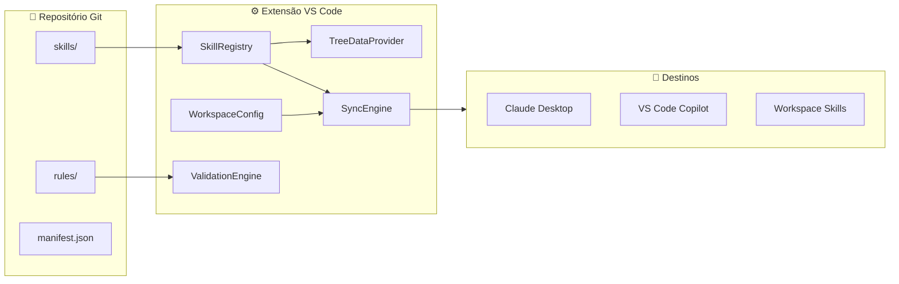
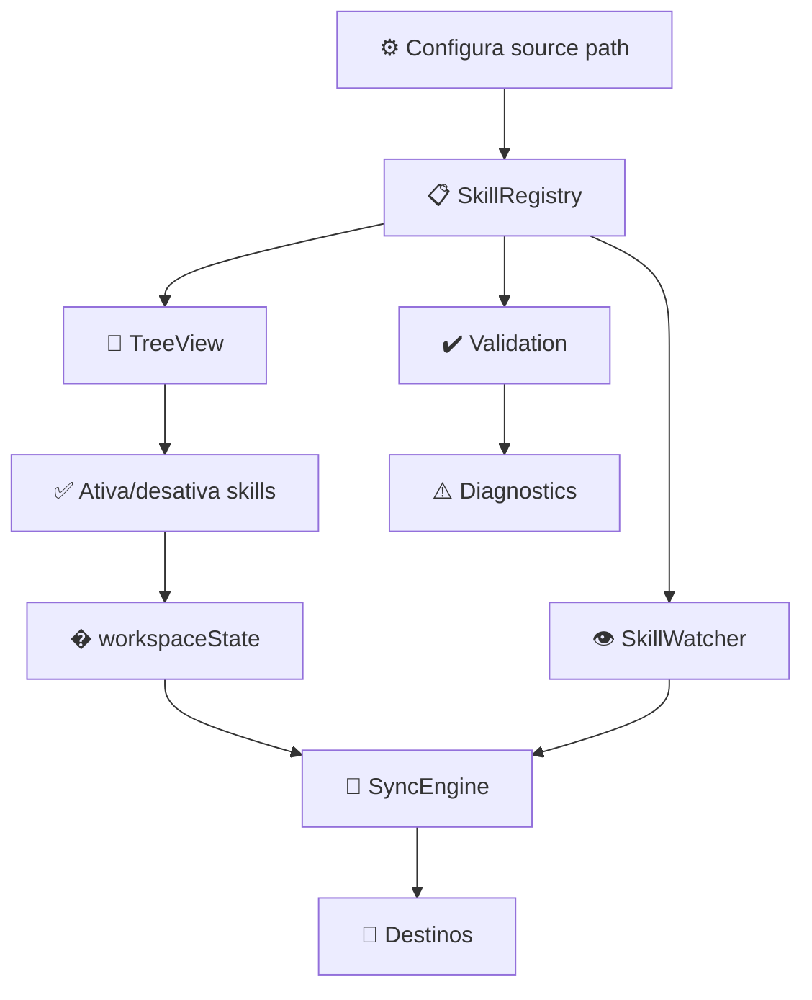

<!-- markdownlint-disable-file MD013 -->

## Arquitetura

## Diagrama de Componentes

## Fluxo de Dados

## Estratégia de Sync

- **Cópia vs Symlink**: Cópia. Mais seguro, evita problemas de permissão e
    cross-device.
- **Auto-sync**: Watch + sync-on-save. Watch para mudanças externas,
    sync-on-save para edições no editor.
- **Remoção ao desativar**: Sim, com marcação. Arquivos gerenciados têm
    header para identificação segura.
- **Conflito de arquivos**: Nunca sobrescrever não-gerenciados. Se o destino
    tem arquivo sem marcação, o arquivo é preservado.

## Ativação

A extensão usa **lazy activation** — ela é carregada apenas quando a sidebar
"Agent Skills" é aberta.
Isso acontece via `onView:skillsExplorer` como activation event e garante zero
overhead para usuários que não usam a extensão na sessão.

Para cenários avançados, a ativação pode ser configurada para modo **eager**
via `agentSkillsManager.activationMode`.
