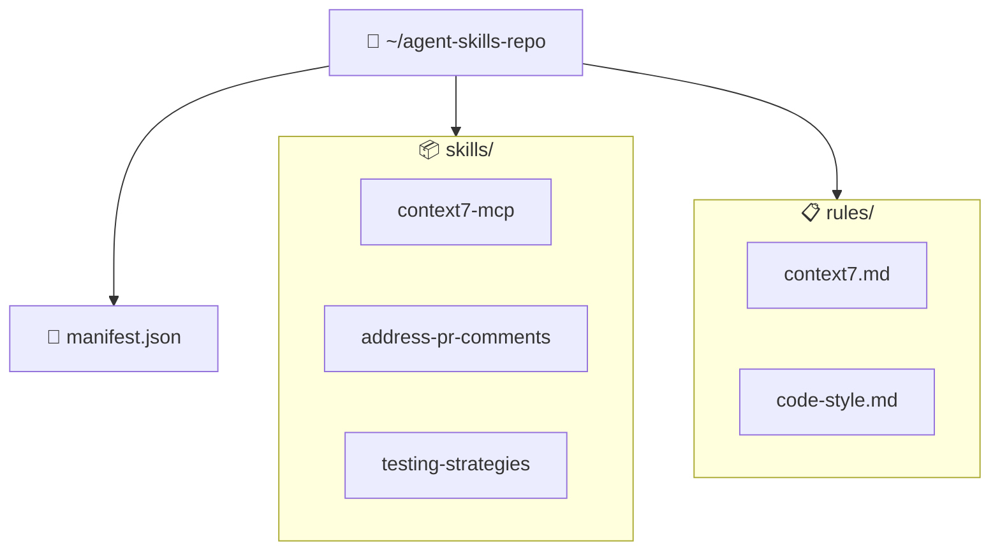

<!-- markdownlint-disable-file MD013 -->

## Primeiros Passos

## Requisitos

- **VS Code** 1.85.0 ou superior
- **Git** instalado e disponível no PATH
- **Repositório de skills** — um repositório git com skills no formato esperado

## Instalação

### Via Marketplace

Procure por **"Agent Skills Manager"** na extensão marketplace do VS Code.

### Via VS Code CLI (recomendado)

> **Dica:** A forma mais rápida de instalar a extensão é pela linha de comando
> usando a CLI do VS Code (`code`).

```bash
# Instalar diretamente da Marketplace
code --install-extension <publisher>.agent-skills-manager
```

### Via VSIX (desenvolvimento)

```bash
# Clonar o repositório
git clone https://github.com/seu-usuario/agent-skills-manager.git
cd agent-skills-manager

# Instalar dependências
npm install

# Compilar
npm run compile

# Empacotar
npm run package

# Instalar a extensão via CLI do VS Code
code --install-extension agent-skills-manager-0.0.1.vsix
```

## Configuração Inicial

### 1. Configurar o Skill Source Path

Abra as settings do VS Code (`Ctrl+,` / `Cmd+,`) e configure:

```jsonc
{
  "agentSkillsManager.skillSourcePath": "/caminho/para/seu/repo-de-skills"
}
```

Ou use o comando **Agent Skills Manager: Configure Skill Source Path**.

### 2. Abrir a Sidebar

Clique no ícone **Agent Skills** na sidebar do VS Code, ou execute o comando
**Agent Skills Manager: Show Skills Explorer**.

### 3. Ativar Skills

Na TreeView, use o botão de toggle (ícone de olho) para ativar ou desativar skills por workspace.

### 4. Configurar Destinos

Nas settings, defina para onde as skills ativas serão sincronizadas:

```jsonc
{
  "agentSkillsManager.destinations": [
    {
      "id": "claude-global",
      "type": "claude",
      "path": "~/.claude/skills",
      "enabled": true
    }
  ]
}
```

## Fluxo de Trabalho Típico

1. **Adicionar uma skill** ao repositório git de skills
2. **Abrir o VS Code** — a extensão detecta a nova skill automaticamente
3. **Ativar a skill** via TreeView (toggle na sidebar)
4. A skill é **copiada automaticamente** para os destinos configurados
5. **Editar a skill** no repositório-fonte — mudanças são sincronizadas automaticamente
6. **Desativar a skill** — o arquivo é removido dos destinos

## Estrutura de Repositório de Skills Recomendada



## Próximos Passos

- [Configuração](./configuration) — Todas as opções de configuração
- [TreeView](./treeview) — Navegação e interações na sidebar
- [Comandos](./commands) — Lista completa de comandos disponíveis
