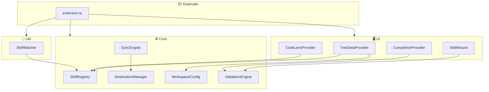

<!-- markdownlint-disable-file MD013 -->

## Componentes Internos

Visão geral de todos os componentes da extensão, suas responsabilidades e
interfaces públicas.

## SkillRegistry

**Arquivo**: `src/core/SkillRegistry.ts`
**Responsabilidade**: Indexar, buscar e filtrar skills e rules do source path.

```typescript
interface SkillRegistry {
  /** Indexa todas as skills/rules do source path */
  refresh(): Promise<void>;

  /** Retorna todas as skills indexadas */
  getAllSkills(): Skill[];

  /** Retorna todas as rules indexadas */
  getAllRules(): Rule[];

  /** Busca skill por nome */
  getSkillByName(name: string): Skill | undefined;

  /** Filtra skills por texto de busca */
  searchSkills(query: string): Skill[];

  /** Filtra por tipo de conteúdo */
  filterByType(type: SkillType): Skill[];

  /** Listener para mudanças no índice */
  onDidChange(callback: () => void): Disposable;
}
```

---

## SyncEngine

**Arquivo**: `src/core/SyncEngine.ts`
**Responsabilidade**: Copiar skills ativas para destinos configurados.

```typescript
interface SyncEngine {
  /** Sincroniza uma skill específica */
  syncSkill(skill: Skill, destinations: DestinationConfig[]): Promise<SyncResult[]>;

  /** Remove uma skill de todos os destinos */
  unsyncSkill(skill: Skill, destinations: DestinationConfig[]): Promise<void>;

  /** Sincroniza todas as skills ativas */
  syncAll(activeSkills: Skill[], destinations: DestinationConfig[]): Promise<SyncResult[]>;

  /** Sincroniza uma rule */
  syncRule(rule: Rule, destinations: DestinationConfig[]): Promise<SyncResult[]>;

  /** Listener para sync events */
  onDidSync(callback: (result: SyncEvent) => void): Disposable;
}
```

---

## ValidationEngine

**Arquivo**: `src/core/ValidationEngine.ts`
**Responsabilidade**: Validar frontmatter YAML e formato de skills/rules.

```typescript
interface ValidationEngine {
  /** Valida uma skill e retorna lista de erros */
  validateSkill(filePath: string): Promise<ValidationResult>;

  /** Valida uma rule e retorna lista de erros */
  validateRule(filePath: string): Promise<ValidationResult>;

  /** Parser de frontmatter YAML */
  parseFrontmatter(content: string): { data: Record<string, any>; body: string };

  /** Publica diagnostics no Problems panel */
  publishDiagnostics(uri: Uri, errors: ValidationError[]): void;

  /** Limpa diagnostics para um arquivo */
  clearDiagnostics(uri: Uri): void;
}
```

A validação é exibida com a Diagnostics API nativa do VS Code, incluindo
erros inline e no painel Problems.

---

## DestinationManager

**Arquivo**: `src/core/DestinationManager.ts`
**Responsabilidade**: Resolver caminhos de destino com variáveis.

```typescript
interface DestinationManager {
  /** Resolve o caminho final de um destino para uma skill */
  resolvePath(destination: DestinationConfig, skill: Skill): string;

  /** Verifica se o destino é gravável */
  checkWriteAccess(path: string): Promise<boolean>;

  /** Detecta conflitos (arquivo existe sem header gerenciado) */
  detectConflicts(destination: DestinationConfig, skill: Skill): Promise<ConflictInfo | null>;

  /** Adiciona header gerenciado ao conteúdo copiado */
  addManagedHeader(content: string, sourcePath: string): string;

  /** Verifica se um arquivo é gerenciado pela extensão */
  isManagedFile(filePath: string): boolean;
}
```

---

## SkillTreeDataProvider

**Arquivo**: `src/providers/SkillTreeDataProvider.ts`
**Responsabilidade**: Fornecer dados para a TreeView da sidebar.

```typescript
interface SkillTreeDataProvider extends TreeDataProvider<SkillTreeItem> {
  /** Atualiza a TreeView */
  refresh(): void;

  /** Alterna ativação de uma skill */
  toggleSkill(skill: Skill): Promise<void>;

  /** Retorna as skills ativas no workspace */
  getActiveSkills(): string[];
}
```

---

## SkillCompletionProvider

**Arquivo**: `src/providers/SkillCompletionProvider.ts`
**Responsabilidade**: IntelliSense para campos de frontmatter em SKILL.md.

```typescript
interface SkillCompletionProvider {
  /** Fornece completion items para campos do frontmatter */
  provideCompletionItems(document: TextDocument, position: Position): CompletionItem[];
}
```

O provider oferece IntelliSense somente para campos de frontmatter YAML.
O corpo markdown da skill é tratado como conteúdo livre.

---

## SkillWatcher

**Arquivo**: `src/watchers/SkillWatcher.ts`
**Responsabilidade**: Monitorar mudanças no source path.

```typescript
interface SkillWatcher {
  /** Inicia monitoramento do source path */
  startWatching(sourcePath: string): void;

  /** Para monitoramento */
  stopWatching(): void;

  /** Listener para eventos de mudança */
  onDidChange(callback: (event: FileChangeEvent) => void): Disposable;
}
```

---

## SkillCreationWizard

**Arquivo**: `src/wizards/SkillCreationWizard.ts`
**Responsabilidade**: Multi-step input para criação de novas skills.

```typescript
interface SkillCreationWizard {
  /** Executa o wizard e retorna os dados da skill criada */
  run(): Promise<Skill | null>;
}
```

---

## WorkspaceConfigManager

**Arquivo**: `src/core/WorkspaceConfigManager.ts`
**Responsabilidade**: Gerenciar ativação de skills por workspace.

```typescript
interface WorkspaceConfigManager {
  /** Carrega config do workspace atual */
  loadConfig(): Promise<WorkspaceConfig>;

  /** Ativa uma skill no workspace */
  activateSkill(skillName: string): Promise<void>;

  /** Desativa uma skill no workspace */
  deactivateSkill(skillName: string): Promise<void>;

  /** Verifica se uma skill está ativa */
  isActive(skillName: string): boolean;

  /** Listener para mudanças na config */
  onDidChange(callback: (config: WorkspaceConfig) => void): Disposable;
}
```

## Diagrama de Dependências


