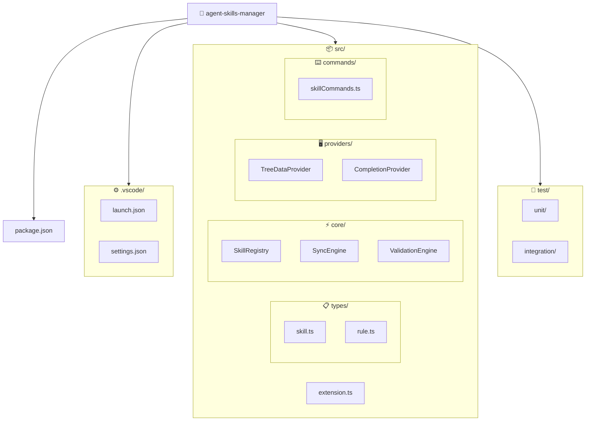

## Estrutura do Projeto

## Diretórios e Arquivos



## package.json — Dependências

### Dependencies

| Pacote      | Versão | Uso                                  |
| ----------- | ------ | ------------------------------------ |
| `yaml`      | ^2.x   | Parse/validate de frontmatter YAML   |
| `glob`      | ^10.x  | Busca de arquivos `SKILL.md` e rules |
| `minimatch` | ^9.x   | Pattern matching de caminhos         |

### DevDependencies

| Pacote                  | Versão  | Uso                                 |
| ----------------------- | ------- | ----------------------------------- |
| `@types/vscode`         | ^1.85.0 | Tipos da API do VS Code             |
| `@types/node`           | ^20.x   | Tipos Node.js                       |
| `typescript`            | ^5.6.x  | Compilador TypeScript               |
| `@vscode/test-electron` | ^2.x    | Testes em instância real do VS Code |
| `@vscode/vsce`          | ^3.x    | Empacotamento `.vsix`               |
| `vitest`                | ^3.x    | Framework de testes unitários       |
| `eslint`                | ^9.x    | Linting                             |
| `@typescript-eslint/*`  | ^8.x    | ESLint plugins TypeScript           |
| `webpack`               | ^5.x    | Bundling                            |
| `webpack-cli`           | ^5.x    | CLI do webpack                      |

## Activation Events

A extensão usa **lazy activation** para minimizar impacto no startup:

```jsonc
{
  "activationEvents": [
    "onView:skillsExplorer"     // Ativa quando a sidebar é aberta
  ]
}
```

Também existe suporte a ativação **eager** via configuração
`agentSkillsManager.activationMode` para fluxos que precisam de comandos
disponíveis logo no início da sessão.

## TypeScript Estrito

O projeto adota `strict: true` no TypeScript para reduzir bugs em tempo de
compilação e melhorar segurança de tipos em toda a extensão.

## Contribuição Points

```jsonc
{
  "contributes": {
    "viewsContainers": {
      "activitybar": [{
        "id": "skills-explorer",
        "title": "Agent Skills",
        "icon": "media/skills-icon.svg"
      }]
    },
    "views": {
      "skills-explorer": [{
        "id": "skillsExplorer",
        "name": "Agent Skills",
        "when": "agentSkillsManager.configured"
      }]
    },
    "commands": [/* ... 15 comandos ... */],
    "menus": { /* ... context menus ... */ },
    "configuration": { /* ... 8 propriedades ... */ }
  }
}
```
