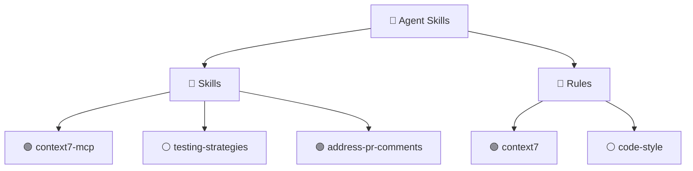
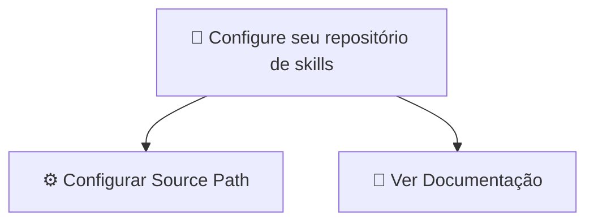
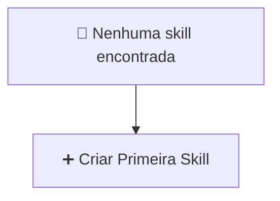

## TreeView — Skills Explorer

A TreeView "Agent Skills" é a interface principal da extensão, exibida na
sidebar do VS Code.

## Estrutura da Árvore

## Ícones

- 🟢 Skill/rule ativa neste workspace
- ⚪ Skill/rule inativa neste workspace
- 📄 Arquivo `SKILL.md` ou `.md`

## Interações

### Clique em uma skill/rule

- **Skill ativa**: Abre o `SKILL.md` no editor
- **Skill inativa**: Ativa a skill e abre o arquivo

### Botão direito (Context Menu)

| Ação                 | Descrição                                   |
| -------------------- | ------------------------------------------- |
| **Ativar Skill**     | Ativa a skill e sincroniza para os destinos |
| **Desativar Skill**  | Desativa e remove dos destinos              |
| **Editar Skill**     | Abre o `SKILL.md` no editor                 |
| **Criar Nova Skill** | Abre o wizard de criação                    |
| **Criar Nova Rule**  | Cria uma nova rule no source                |
| **Copiar Caminho**   | Copia o caminho absoluto da skill           |
| **Renomear**         | Renomeia a skill (pasta + frontmatter)      |
| **Excluir**          | Remove a skill do repositório               |
| **Sincronizar**      | Força sync manual de uma skill específica   |

### Actions na TreeView

- **Refresh**: Recarrega o índice de skills do source path
- **Create Skill**: Abre o wizard de criação de nova skill
- **Create Rule**: Cria uma nova rule

## Views de Boas-vindas

Quando a extensão é ativada mas o source path não está configurado, a TreeView
exibe uma view de boas-vindas com ações rápidas:

### Sem Source Path Configurado

### Source Path Vazio

