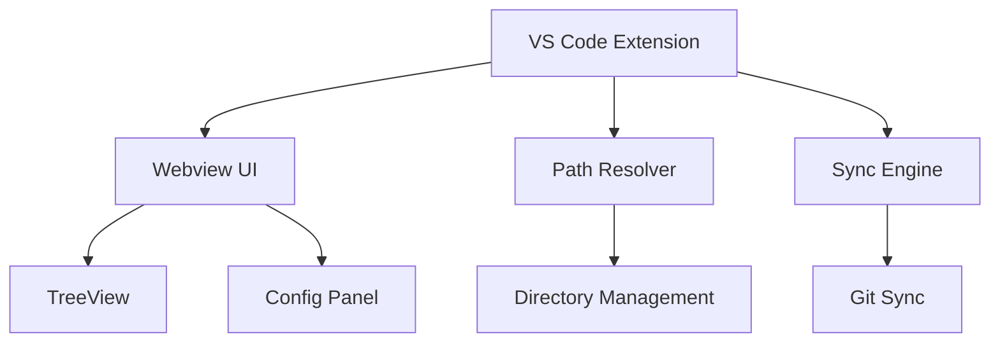
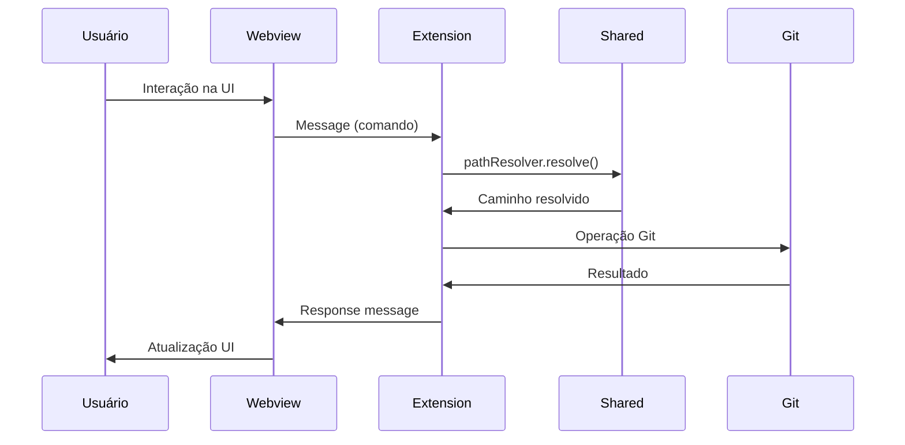

# Arquitetura

## Componentes



## 1. Extension (`extension/`)

**Arquivos**:
- `src/extension.ts` - Ativação e comandos
- `esbuild.js` - Build configuration

**Responsabilidades**:
- Registro de comandos VS Code
- Lifecycle management
- Integração VS Code API

## 2. Webview (`webview/`)

**Stack**: React 19, TypeScript, Vite

**Componentes**:
- TreeView - Navegação hierárquica
- Config Panel - Visualização/edição
- Sync Panel - Controles de sincronização

## 3. Shared (`shared/`)

**Módulos**:
- `path-resolver.ts` - Resolução de paths
- `types.ts` - Interfaces e tipos compartilhados
- `index.ts` - Exportação de módulos

## Estrutura

```
agent-skills-manager/
├── extension/        # VS Code extension (Node.js)
├── webview/          # React UI (TypeScript + Vite)
├── shared/           # Tipos e utilitários compartilhados
│   ├── src/
│   │   ├── types.ts         # Interfaces e tipos
│   │   ├── path-resolver.ts # Resolução de paths
│   │   └── index.ts         # exports
│   └── package.json
└── docusaurus/       # Documentação
```

**Decisão**: Usar pnpm workspaces para gerenciar múltiplos pacotes

**Racional**:
- Compartilhamento eficiente de dependências
- Build coordenado entre packages
- Versionamento sincronizado

### TypeScript em Todo Lugar

**Decisão**: TypeScript estrito em todos os pacotes

**Racional**:
- Type safety entre boundaries
- Melhor DX com autocomplete
- Refatoração segura

## Fluxo de Dados



## Padrões de Projeto

### Message Passing

Comunicação entre extension e webview usa message passing assíncrono:

```typescript
// Webview → Extension
vscode.postMessage({ type: 'SYNC_PATTERN', payload: {...} })

// Extension → Webview
webview.postMessage({ type: 'SYNC_COMPLETE', status: 'success' })
```

### Path Resolution

Resolução de caminhos centralizada no módulo shared:

```typescript
const resolver = new PathResolver(workspaceRoot)
const skillsPath = resolver.resolve('skills')
```

### Tipos Compartilhados

Interfaces e tipos definidos em `shared/types.ts`:

```typescript
interface AppConfig {
  agent: 'copilot' | 'claude'
}
```

## Considerações de Performance

### Lazy Loading

- Webview carregada sob demanda
- TreeView com virtualização para listas grandes
- Code splitting no build do React

### Cache

- Paths resolvidos em cache
- Estado da UI persistido entre sessões
- Git operations otimizadas

## Segurança

### Webview Security

- Content Security Policy restritiva
- Sanitização de inputs do usuário
- Validação de paths antes de operações

### Git Operations

- Validação de branches e tags
- Prevenção de overwrite acidental
- Conflict detection pré-sincronização
