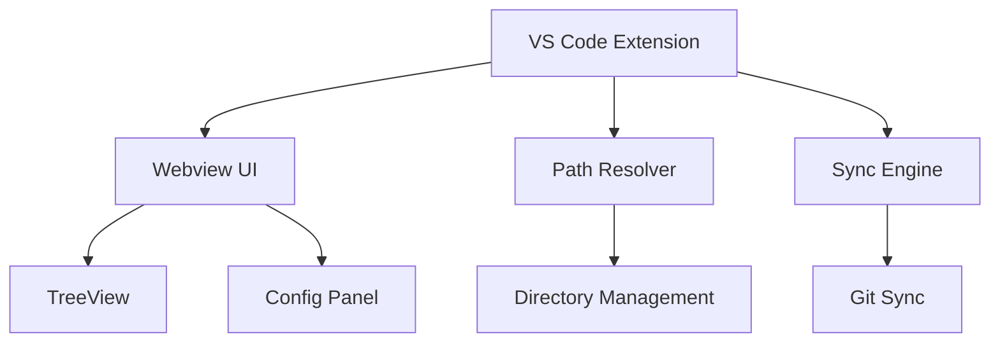

# Visão Geral

## Componentes



## 1. Extension (`extension/`)

**Arquivos**:
- `src/extension.ts` - Ativação e comandos
- `esbuild.js` - Build configuration

**Responsabilidades**:
- Registro de comandos VS Code
- Lifecycle management
- Integração VS Code API

## 2. Webview (`webview/`)

**Stack**: React 19, TypeScript, Vite

**Componentes**:
- TreeView - Navegação hierárquica
- Config Panel - Visualização/edição
- Sync Panel - Controles de sincronização

## 3. Shared (`shared/`)

**Módulos**:
- `path-resolver.ts` - Resolução de paths
- `types.ts` - Interfaces e tipos compartilhados
- `index.ts` - Exportação de módulos

## Estrutura

```
agent-skills-manager/
├── extension/        # VS Code extension (Node.js)
├── webview/          # React UI (TypeScript + Vite)
├── shared/           # Tipos e utilitários compartilhados
└── docusaurus/       # Documentação
```

**Decisão**: Usar pnpm workspaces para gerenciar múltiplos pacotes

**Racional**:
- Compartilhamento eficiente de dependências
- Build coordenado entre packages
- Versionamento sincronizado

