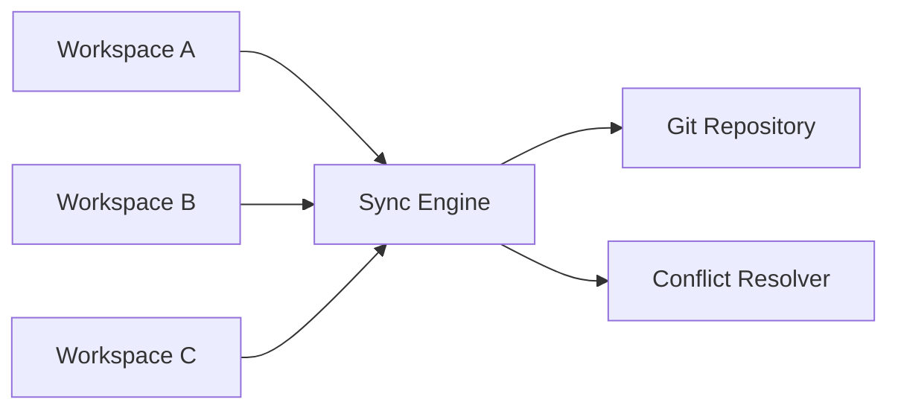
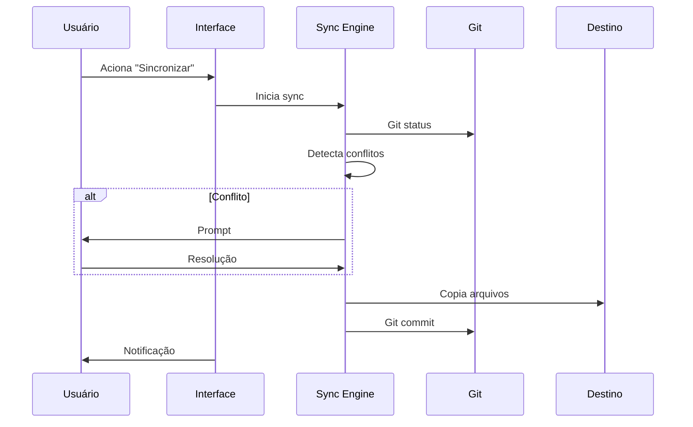
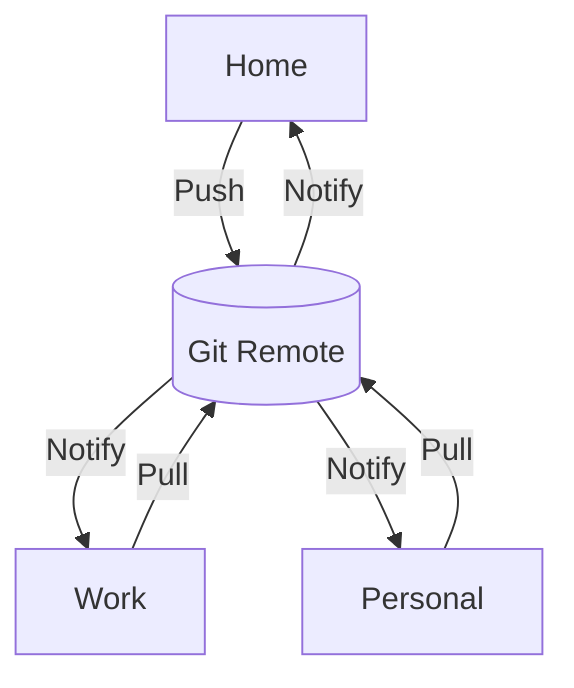

# Fluxo de Sincronização

## Arquitetura



## Componentes

### Sync Engine
- Detecção de mudanças
- Comparação (timestamps, hashes)
- Coordenação de cópia
- Integração Git

### Path Resolver
- Normalização de paths
- Validação de diretórios
- Resolução de variáveis de ambiente
- Suporte a symlinks

### Conflict Resolver
- Detecção por timestamp/hash
- Merge automático
- Intervenção do usuário (quando necessário)

## Fluxos

### Sync Manual



### Auto Sync

Trigger: `autoSync: true`

1. File watcher detecta mudança
2. Debounce: 500ms
3. Executa sync
4. Atualiza UI

## Git

### Estrutura

```
workspace/
├── .git/
├── .vscode/agent-skills-manager.json
├── .agent-skills/
│   ├── skills/
│   └── agents/
└── src/
```

### Versionamento

- Branch `main`: patterns estáveis
- Tags: versões específicas
- Feature branches: desenvolvimento
- Merge: via pull request

### Operações Automáticas

```bash
git add .
git commit -m "sync: Update patterns from [workspace]"
git push origin main
```

### Conflitos Git

**Fluxo**:
1. Detecção (sync engine)
2. Notificação (UI)
3. Resolução (usuário)
4. Commit (automático)

**Opções**:
- Aceitar local
- Aceitar remoto
- Merge editor
- Cancelar

## Políticas de Sync

### Direção

```json
{ "syncDirection": "push" }    // Workspace → Destinos
{ "syncDirection": "pull" }    // Destinos → Workspace
{ "syncDirection": "bidirectional" } // Ambos
```

### Bidirecional (Padrão)

```json
{ "syncDirection": "bidirectional" }
```

## Detecção de Conflitos

### Timestamp

```typescript
if (localFile.mtime > remoteFile.mtime) {
  // Local mais recente
}
```

### Hash (SHA-256)

```typescript
const localHash = crypto.createHash('sha256').update(localContent).digest('hex')
const remoteHash = crypto.createHash('sha256').update(remoteContent).digest('hex')

if (localHash !== remoteHash) {
  // Conflito detectado
}
```

### Merge Base

```bash
git merge-base --is-ancestor commit-a commit-b
```

## Merge Automático

**Casos suportados**:
- Arquivos diferentes
- Mesmas modificações
- Mudanças em linhas diferentes

**Exemplo**:
```
Workspace A: Adiciona skill "react"
Workspace B: Adiciona skill "python"
→ Merge: Ambos skills presentes
```

**Requer intervenção**:
- Mesma linha modificada
- Arquivo deletado vs modificado
- Conflitos semânticos

## Fluxo Multi-Workspace



**Sequência**:

1. Usuário em Home modifica skill "react"
2. Executa sync → Push para Git remote
3. Work recebe notificação de mudança
4. Usuário em Work executa sync → Pull do Git
5. Personal também recebe notificação
6. Cada workspace resolve independentemente

## Comandos Disponíveis

### Sincronizar Agora

```
Command Palette → Agent Skills: Sync Now
```

Executa sincronização manual imediata
