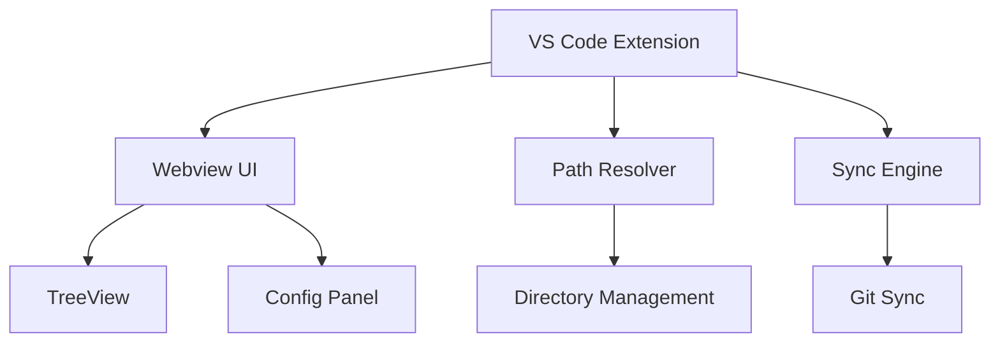

# Componentes do Sistema

## Visão Geral da Arquitetura




### 1. VS Code Extension

**Localização**: `extension/`

**Status**: 🟡 Estrutura criada, implementação pendente

**Responsabilidades**:
- Ativação e lifecycle management
- Registro de comandos VS Code
- Message passing com webview
- Integração com VS Code API

**Comandos Registrados**: 🔴 Pendente implementação
- `agent-skills-manager.sync` - Sincronizar patterns (planejado)
- `agent-skills-manager.config` - Abrir configuração (planejado)
- `agent-skills-manager.refresh` - Atualizar tree view (planejado)

**Arquivos Principais**:
- `src/extension.ts` - Ponto de entrada
- `esbuild.js` - Configuração de build com esbuild

### 2. Webview UI

**Localização**: `webview/`

**Status**: 🟡 App básico funciona, componentes pendentes

**Stack Tecnológico**:
- React 19
- TypeScript
- Vite (build)
- shadcn/ui (componentes)
- Tailwind CSS v4

**Componentes**:

#### App.tsx
- Root component

#### TreeView
- Navegação hierárquica por skills e agents (planejado)
- Virtualização para listas grandes (planejado)
- **Status**: Não implementado

#### Config Panel
- Visualização e edição de configuração
- Integração com VS Code settings

#### Sync Panel
- Controles de sincronização (planejado)
- Preview de changes (planejado)
- **Status**: Não implementado

### 3. Path Resolver

**Localização**: `shared/src/`

**Responsabilidades**:
- Normalização de paths
- Validação de diretórios
- Resolução de caminhos relativos/absolutos

**API**:
```typescript
const resolver = new PathResolver(workspaceRoot)
const skillsPath = resolver.resolve('skills')
```

### 4. Sync Engine

**Localização**: `extension/src/` (planejado)

**Responsabilidades (Planejadas)**:
- Detecção de mudanças
- Comparação de hashes (SHA-256)
- Coordenação de cópia entre workspaces
- Integração com Git (simple-git)

**Fluxo Planejado**:
1. Monitora arquivos via file watcher
2. Calcula hash dos arquivos modificados
3. Compara com destino
4. Resolve conflitos (automático ou manual)
5. Executa sync e commit Git

**Dependências Planejadas**:
- `simple-git` para operações Git
- `crypto` (Node.js builtin) para hashes SHA-256
