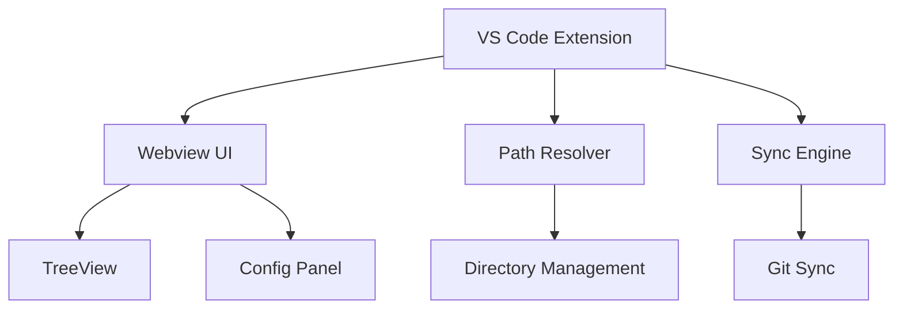

# Componentes do Sistema

## Visão Geral da Arquitetura



## Componentes Principais

### 1. VS Code Extension

**Localização**: `extension/`

**Responsabilidades**:
- Ativação e lifecycle management
- Registro de comandos VS Code
- Message passing com webview
- Integração com VS Code API

**Comandos Registrados**:
- `agent-skills-manager.sync` - Sincronizar patterns
- `agent-skills-manager.config` - Abrir configuração
- `agent-skills-manager.refresh` - Atualizar tree view

**Arquivos Principais**:
- [`src/extension.ts`](https://github.com/gugacarbo/agent-skills-manager/tree/main/extension/src/extension.ts) - Ponto de entrada
- [`esbuild.js`](https://github.com/gugacarbo/agent-skills-manager/tree/main/extension/esbuild.js) - Configuração de build

### 2. Webview UI

**Localização**: `webview/`

**Stack Tecnológico**:
- React 19
- TypeScript
- Vite (build)
- React Hooks + Context (state)

**Componentes**:

#### App.tsx
- Root component
- Estado global
- Roteamento
- Theme provider

#### TreeView
- Navegação hierárquica por skills e agents
- Virtualização para listas grandes
- Interações: click, double-click, right-click

#### Config Panel
- Visualização e edição de configuração
- Integração com VS Code settings
- Validação em tempo real

#### Sync Panel
- Controles de sincronização
- Preview de changes
- Resolução de conflitos

### 3. Path Resolver

**Localização**: `shared/`

**Responsabilidades**:
- Normalização de paths
- Validação de diretórios
- Resolução de caminhos relativos/absolutos

**Uso**:
```typescript
const resolver = new PathResolver(workspaceRoot)
const skillsPath = resolver.resolve('skills')
```

### 4. Sync Engine

**Localização**: `extension/src/` (implementação principal)

**Responsabilidades**:
- Detecção de mudanças
- Comparação de hashes (SHA-256)
- Coordenação de cópia entre workspaces
- Integração com Git

**Fluxo**:
1. Monitora arquivos via file watcher
2. Calcula hash dos arquivos modificados
3. Compara com destino
4. Resolve conflitos (automático ou manual)
5. Executa sync e commit Git

## Referências

- [Estrutura de Diretórios](./02-estrutura-diretorios.md) - Organização do código
- [Padrões de Projeto](./03-padroes-projeto.md) - Message passing e padrões
- [Configuração e Validação](../implementacao/01-configuracao-validacao.md) - Schema Zod
- [Sincronização](../implementacao/02-sincronizacao.md) - Detalhes do Sync Engine
