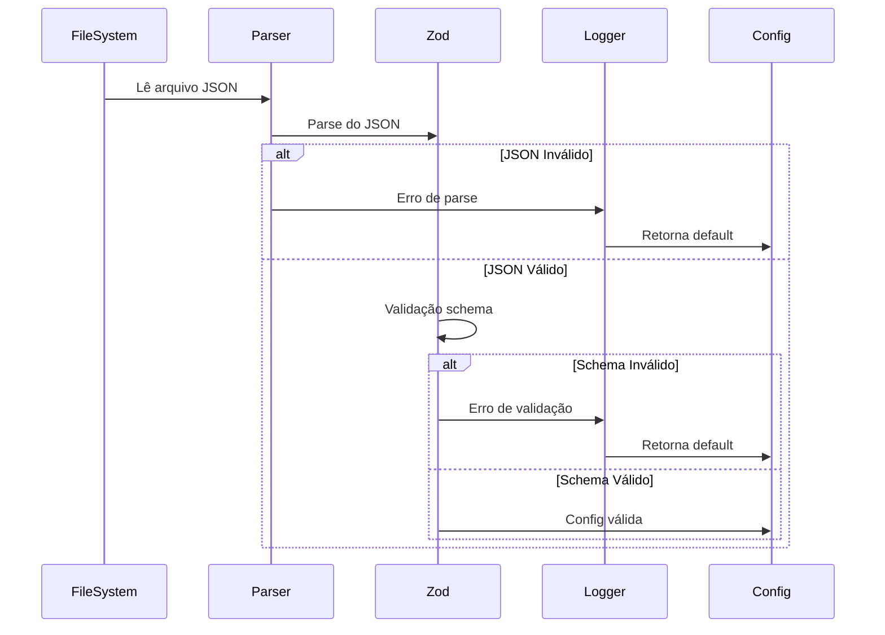

# Configuração e Validação

## 1. Schema Zod como Fonte de Verdade

**Decisão**: Usar **Zod** para validação runtime

**Racional**:
- Type safety end-to-end com TypeScript
- Validação em runtime de arquivos carregados
- Mensagens de erro claras e úteis
- Schema como fonte de verdade única

**Implementação**:
1. Instalar `zod` no shared package
2. Implementar `ConfigSchema` em `shared/src/types.ts`
3. Exportar tipos e validadores

## 2. Schema de Configuração

```typescript
import { z } from 'zod'

export const ConfigSchema = z.object({
  agent: z
    .enum(['copilot', 'claude'])
    .default('copilot')
    .describe('Agent padrão para skills'),

  syncDirection: z
    .enum(['push', 'pull', 'bidirectional'])
    .default('bidirectional')
    .describe('Direção da sincronização'),

  autoSync: z
    .boolean()
    .default(false)
    .describe('Habilita auto-sync via file watcher'),

  debounceMs: z
    .number()
    .min(0)
    .max(10000)
    .default(500)
    .describe('Debounce em ms para file watcher'),

  logLevel: z
    .enum(['error', 'warn', 'info', 'debug'])
    .default('info')
    .describe('Nível de log'),

  logToFile: z
    .boolean()
    .default(false)
    .describe('Habilita log em arquivo'),
})

export type Config = z.infer<typeof ConfigSchema>
```

## 3. Campos de Configuração

| Campo           | Tipo    | Padrão          | Descrição                                   |
| --------------- | ------- | --------------- | ------------------------------------------- |
| `agent`         | string  | `copilot`       | Agent padrão: `copilot` ou `claude`         |
| `syncDirection` | string  | `bidirectional` | Direção: `push`, `pull`, ou `bidirectional` |
| `autoSync`      | boolean | `false`         | Habilita auto-sync via file watcher         |
| `debounceMs`    | number  | `500`           | Debounce em ms para file watcher            |
| `logLevel`      | string  | `info`          | Nível de log                                |
| `logToFile`     | boolean | `false`         | Habilita log em arquivo                     |

## 4. Arquivos de Configuração

### Configuração Global

**Path**: `~/.vscode/extensions/agent-skills-manager/config.json`

**Escopo**: Todos os workspaces

**Prioridade**: Baixa (sobrescrita por workspace)

### Configuração por Workspace

**Path**: `.vscode/agent-skills-manager.json`

**Escopo**: Projeto específico

**Prioridade**: Alta (sobrescreve global)

### Settings do VS Code

```json
{
  "agent-skills-manager.agent": "copilot",
  "agent-skills-manager.autoSync": true
}
```

## 5. Fluxo de Validação



**Implementação**:
```typescript
function loadConfig(filePath: string): Config {
  try {
    const rawConfig = JSON.parse(fs.readFileSync(filePath, 'utf-8'))
    const result = ConfigSchema.safeParse(rawConfig)

    if (!result.success) {
      logger.error('Config inválida', result.error)
      return getDefaultConfig()
    }

    return result.data
  } catch (error) {
    logger.error('Erro ao ler config', error)
    return getDefaultConfig()
  }
}
```
