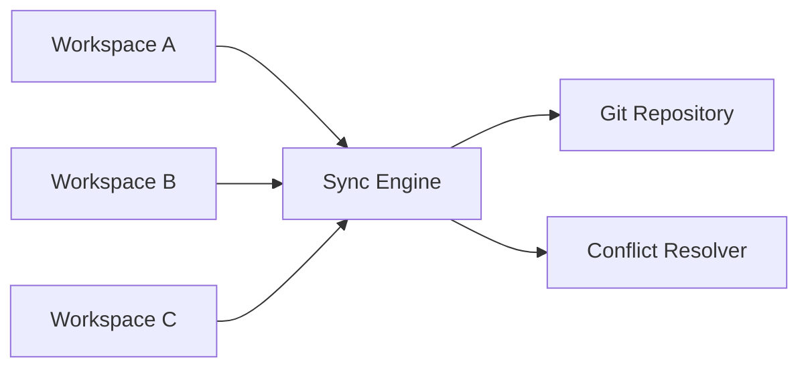
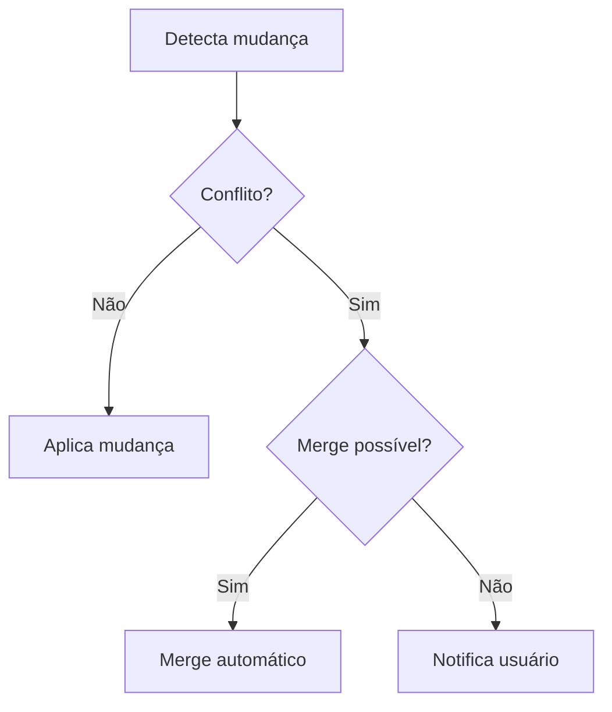

# Sincronização

## 1. Arquitetura do Sync Engine



## 2. Detecção de Mudanças

### Estratégias

| Método       | Precisão | Performance |
| ------------ | -------- | ----------- |
| Timestamp    | Média    | Rápida      |
| Hash SHA-256 | Alta     | Variável    |
| Git diff     | Alta     | Lenta       |

### Comparação por Hash

```typescript
async function calculateHash(filePath: string): Promise<string> {
  const content = await fs.readFile(filePath)
  return crypto.createHash('sha256').update(content).digest('hex')
}
```

## 3. Resolução de Conflitos

### Tipos de Conflito

| Tipo        | Descrição          | Resolução          |
| ----------- | ------------------ | ------------------ |
| `same`      | Arquivos idênticos | Nenhuma ação       |
| `different` | Conteúdo diferente | Merge automático   |
| `conflict`  | Ambos modified     | Intervenção manual |

### Fluxo de Resolução



## 4. Integração Git

### Operações

- **Auto-commit** após sync
- **Auto-pull** antes do sync
- **Push** automático
- **Retry** com backoff exponencial

### Tratamento de Erros

- Erros de rede: retry com backoff
- Conflitos Git: notificação ao usuário
- Merge conflicts: fallback para resolução manual

## 5. Histórico de Operações

- Log de operações realizadas
- Audit trail de mudanças
- Rollback de operações

