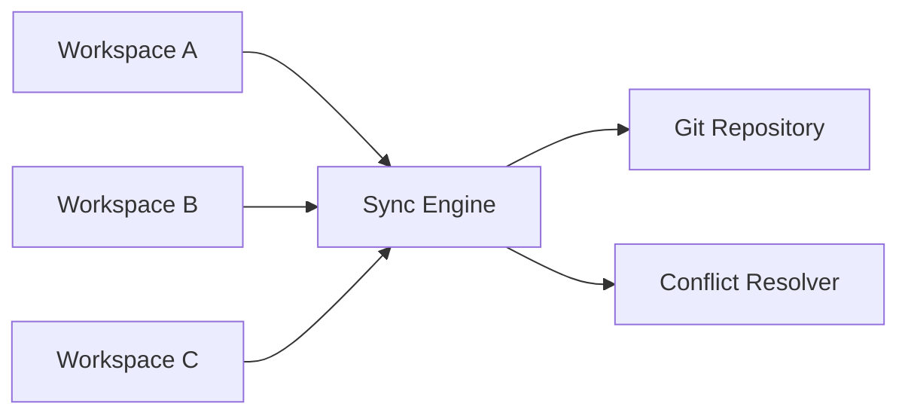
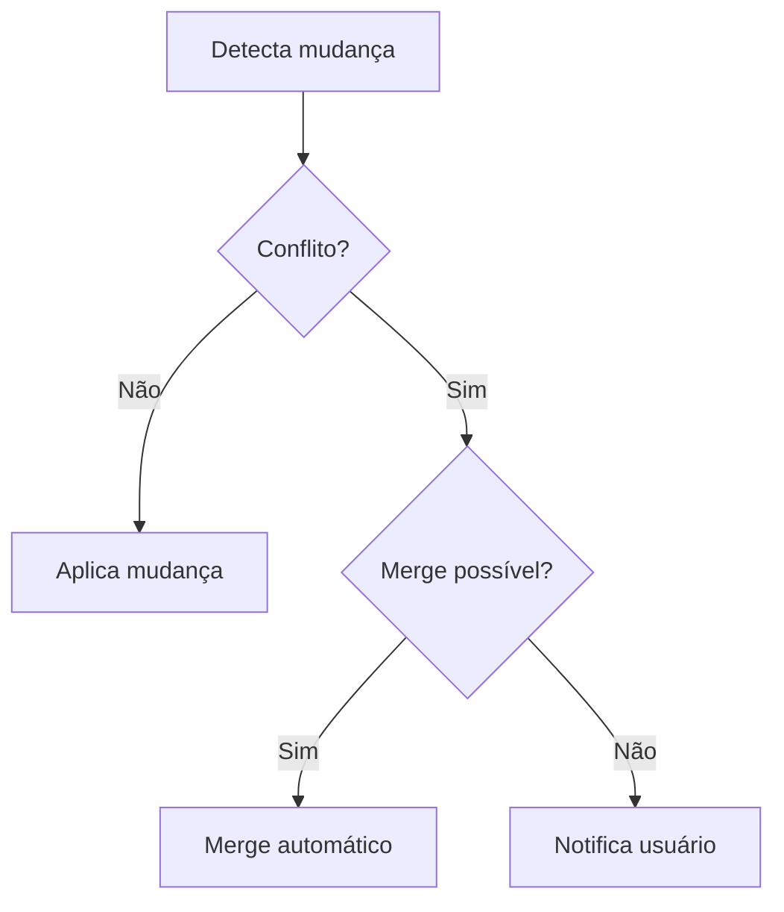

# Sincronização

## 1. Arquitetura do Sync Engine



## 2. Detecção de Mudanças

### Estratégias

| Método       | Precisão | Performance |
| ------------ | -------- | ----------- |
| Timestamp    | Média    | Rápida      |
| Hash SHA-256 | Alta     | Variável    |
| Git diff     | Alta     | Lenta       |

### Comparação por Hash

```typescript
async function calculateHash(filePath: string): Promise<string> {
  const content = await fs.readFile(filePath)
  return crypto.createHash('sha256').update(content).digest('hex')
}
```

## 3. Resolução de Conflitos

### Tipos de Conflito

| Tipo        | Descrição                                      | Resolução          |
| ----------- | ---------------------------------------------- | ------------------ |
| `same`      | Arquivos idênticos (hash SHA-256 igual)        | Nenhuma ação       |
| `different` | Alterações em regiões não-sobrepostas          | Merge automático   |
| `conflict`  | Alterações na mesma região ou ambiguidade      | Intervenção manual |

**Cenários Detalhados**:
- **same**: Hash SHA-256 idêntico → skip sync
- **different**: Arquivo modificado apenas em um workspace → cópia direta
- **different (merge)**: Linhas diferentes no mesmo arquivo → merge linha a linha
- **conflict**: Mesma linha modificada em ambos workspaces → prompt usuário

### Fluxo de Resolução



### Estratégia de Merge

**Decisão**: auto-merge conservador com fallback manual.

- Auto-merge apenas quando alterações não sobrepõem blocos da mesma região
- Qualquer ambiguidade vira conflito manual
- Sempre registrar decisão no histórico de operações

### Política de Delete e Rename

**Decisão**: sincronizar deleções e renomeações com preview configurável.

- Preview habilitado por padrão para delete/rename
- Usuário pode configurar auto-aprovação (`autoApproveDeletes: boolean`)
- Aplicação em lote após confirmação (ou automática se configurado)
- Rollback não implementado na Fase 2

## 4. Integração Git

### Operações

- **Auto-commit** após sync
- **Auto-pull** antes do sync (padrão: primeiro sync, configurável via `gitPullTiming`)
- **Push** automático (configurável)
- **Retry** com backoff exponencial

### Tratamento de Erros

- Erros de rede: retry com backoff
- Conflitos Git: notificação ao usuário
- Merge conflicts: fallback para resolução manual

## 5. Histórico de Operações

- Log de operações realizadas
- Audit trail de mudanças
- ~~Rollback de operações~~ (removido da Fase 2)

## 6. Métrica de Performance

- Métrica principal: throughput (arquivos por minuto)
- Benchmark inicial: A definir (cenário específico será documentado posteriormente)

