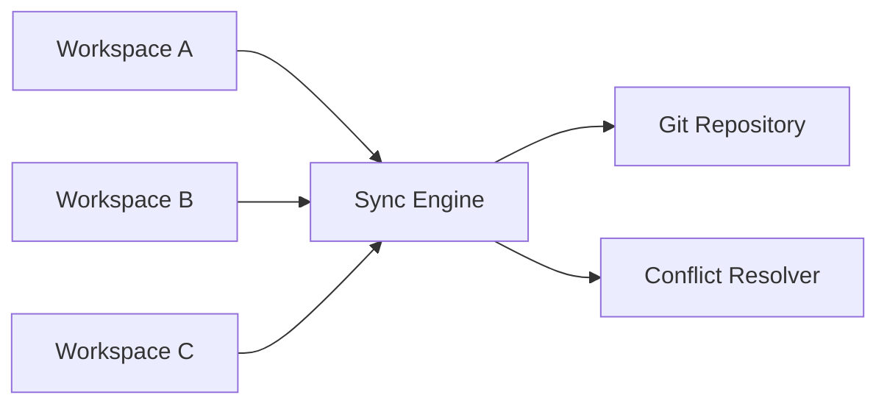
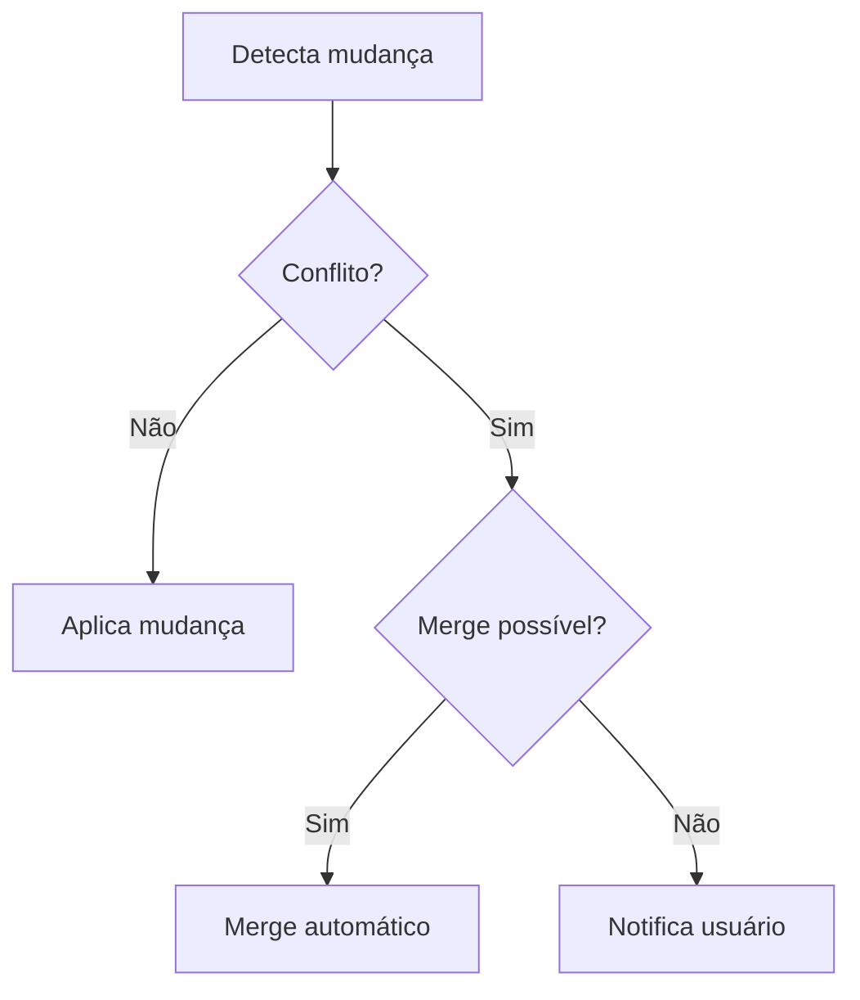

# Sincronização

## 1. Arquitetura do Sync Engine



## 2. Detecção de Mudanças

### Estratégia Híbrida (Aprovada)

**Decisão**: Usar estratégia híbrida para otimizar performance mantendo precisão.

Algoritmo:
1. Comparar timestamp + tamanho primeiro (fast path)
2. Se iguais → assumir sem mudança (skip)
3. Se diferentes → calcular SHA-256 para confirmar
4. Comparar hashes para decisão final

| Método            | Precisão | Performance | Uso                        |
| ----------------- | -------- | ----------- | -------------------------- |
| Timestamp + Size  | Média    | Muito Rápida| Triagem inicial            |
| Hash SHA-256      | Alta     | Variável    | Confirmação quando diferente|
| Git diff          | Alta     | Lenta       | Não usado                  |

### Comparação por Hash

```typescript
async function calculateHash(filePath: string): Promise<string> {
  const content = await fs.readFile(filePath)
  return crypto.createHash('sha256').update(content).digest('hex')
}
```

Ver [ADR-008](../../03-implementation/adr/ADR-008-hash-strategy.md) para detalhes completos.

## 3. Resolução de Conflitos

### Tipos de Conflito

| Tipo        | Descrição                                      | Resolução          |
| ----------- | ---------------------------------------------- | ------------------ |
| `same`      | Arquivos idênticos (hash SHA-256 igual)        | Nenhuma ação       |
| `different` | Alterações em regiões não-sobrepostas          | Merge automático   |
| `conflict`  | Alterações na mesma região ou ambiguidade      | Intervenção manual |

**Cenários Detalhados**:
- **same**: Hash SHA-256 idêntico → skip sync
- **different**: Arquivo modificado apenas em um workspace → cópia direta
- **different (merge)**: Linhas diferentes no mesmo arquivo → merge linha a linha
- **conflict**: Mesma linha modificada em ambos workspaces → prompt usuário

### Fluxo de Resolução



### Estratégia de Merge

**Decisão**: auto-merge conservador com fallback manual.

- Auto-merge apenas quando alterações não sobrepõem blocos da mesma região
- Qualquer ambiguidade vira conflito manual
- Sempre registrar decisão no histórico de operações

### Política de Delete e Rename

**Decisão**: sempre perguntar ao usuário, sem opção de auto-aprovação.

- Preview detalhado obrigatório para delete/rename
- Usuário deve confirmar explicitamente cada operação destrutiva
- Sem configuração `autoApproveDeletes` (máxima segurança)
- Aplicação em lote após confirmação

Ver [ADR-011](../../03-implementation/adr/ADR-011-delete-rename-policy.md) para detalhes.

## 4. Integração Git

### Operações

- **Auto-commit** após sync
- **Auto-pull** nunca automático (usuário faz pull manual)
- **Push** automático (configurável)
- **Retry** com backoff exponencial (3x: 2s, 4s, 8s)

Ver [ADR-009](../../03-implementation/adr/ADR-009-git-pull-policy.md) e [ADR-010](../../03-implementation/adr/ADR-010-retry-policy.md).

### Tratamento de Erros

- Erros de rede: retry 3x com backoff exponencial (2s, 4s, 8s)
- Conflitos Git: notificação ao usuário
- Merge conflicts: fallback para resolução manual

## 5. Histórico de Operações

- Log estruturado de operações realizadas
- Audit trail de mudanças com timestamps
- Rollback via Git history (comandos `git revert` ou `git reset`)

Ver [ADR-012](../../03-implementation/adr/ADR-012-rollback-removal.md) para decisão sobre rollback.

## 6. Métricas de Performance

- **Abordagem**: Otimizar conforme necessário, sem targets fixos
- Monitoramento qualitativo: sem lag perceptível na UI
- Benchmark será definido em cenários específicos quando necessário

Ver [ADR-008](../../03-implementation/adr/ADR-008-hash-strategy.md) para estratégia de performance.

