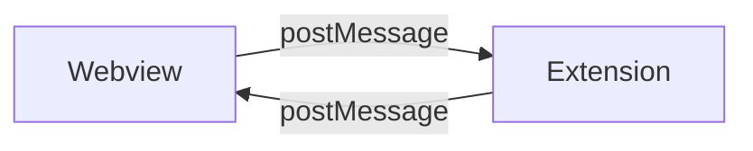

# Message Passing

## Visão Geral

Comunicação bidirecional entre a VS Code Extension (Node.js) e a Webview (React) usando `postMessage`.

## Arquitetura



## Webview → Extension

```typescript
vscode.postMessage({
  type: 'SYNC_PATTERN',
  payload: { destination: 'workspace-1' }
})
```

## Extension → Webview

```typescript
webview.postMessage({
  type: 'SYNC_COMPLETE',
  status: 'success',
  data: { syncedFiles: 5 }
})
```

## Tipos de Mensagem

| Tipo            | Direção             | Payload                   | Descrição                   |
| --------------- | ------------------- | ------------------------- | --------------------------- |
| `SYNC_PATTERN`  | Webview → Extension | `{ destination: string }` | Inicia sincronização        |
| `SYNC_COMPLETE` | Extension → Webview | `{ status, data }`        | Sync finalizado             |
| `SYNC_ERROR`    | Extension → Webview | `{ error }`               | Erro no sync                |
| `CONFIG_UPDATE` | Bidirecional        | `{ config }`              | Atualização de configuração |
| `TREE_REFRESH`  | Extension → Webview | `{ }`                     | TreeView precisa atualizar  |
| `GET_STATUS`    | Webview → Extension | `{ }`                     | Request status              |

## Tratamento de Erros

```typescript
window.addEventListener('message', (event) => {
  const { type, payload } = event.data

  switch (type) {
    case 'SYNC_ERROR':
      showErrorNotification(payload.error)
      break
    default:
      console.warn('Unknown message type:', type)
  }
})
```

## Referências

- [Componentes](../arquitetura/01-componentes.md) - Visão geral dos componentes
- [Padrões de Projeto](../arquitetura/03-padroes-projeto.md) - Outros padrões
