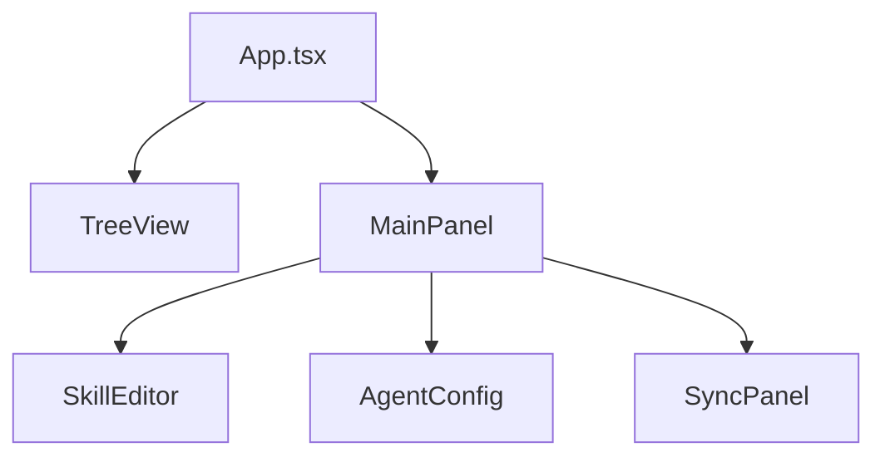

# Componentes UI

## Stack

- React 19 + TypeScript
- Vite (build)
- Webview VS Code

## Arquitetura



## Componentes

### App.tsx
- Root component
- Estado global
- Roteamento
- Theme provider

### TreeView
- Navegação hierárquica (skills/agents)
- Expansão/recolhimento de nós
- Seleção múltipla

**Estrutura**:
```
📁 Skills/
  ├── 📁 react/
  └── 📁 python/
📁 Agents/
```

**Interações**:
- Click → Seleciona
- Double-click → Abre editor
- Right-click → Menu de contexto

### AgentConfig

- Seletor de agent (copilot/claude)
- Configurações globais
- Settings do VS Code integration

## VS Code API

### Message Passing

```typescript
// Webview → Extension
vscode.postMessage({ type: 'SYNC_REQUEST', payload: { destination: 'workspace-1' } })

// Extension → Webview
window.addEventListener('message', event => {
  const { type, payload } = event.data
})
```
