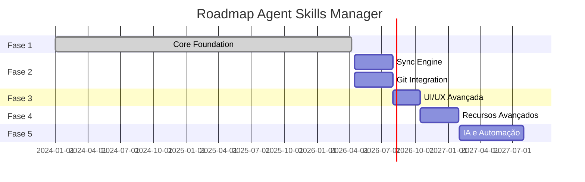

# Fases da Implementação

## Visão Geral do Roadmap

---

## Fase 1 - Core Foundation

**Período**: Q1 2024 - Q2 2026

### Entregas

| Entrega                      | Descrição                      | Status |
| ---------------------------- | ------------------------------ | ------ |
| Estrutura extensão VS Code   | Pastas e configs criadas       | ✅ Done |
| Webview (React + TypeScript) | Build configurado              | ✅ Done |
| Path resolver                | Módulo a implementar           | 📋 Todo |
| TreeView                     | Navegação hierárquica          | 📋 Todo |
| Configuração JSON            | Schema Zod implementado        | ✅ Done |
| VS Code API integration      | activate/deactivate funcionais | ✅ Done |

### Critérios de Aceite

- [x] Extensão carrega no VS Code
- [x] Webview renderiza corretamente
- [ ] PathResolver implementado e testado
- [ ] TreeView navega por skills/agents
- [ ] Configuração é lida/salva
- [ ] Message passing funciona

### Lições Aprendidas

- **pnpm workspaces**: Escolha correta para monorepo
- **React 19**: Funciona bem com Vite
- **TypeScript**: Type sharing entre extension/webview é essencial

---

## Fase 2 - Sincronização e Git

**Período**: Q2-Q3 2026

### Entregas

#### Sync Engine
- [ ] Detecção de mudanças
- [ ] Comparação de hashes (SHA-256)
- [ ] Coordenação de cópia
- [ ] Integração com file watcher

#### Detecção de Conflitos
- [ ] Comparação por timestamp
- [ ] Comparação por hash
- [ ] Verificação de merge base no Git
- [ ] Classificação de tipos de conflito

#### Merge Automático
- [ ] Merge de arquivos diferentes
- [ ] Merge de linhas diferentes
- [ ] Detecção de conflitos semânticos
- [ ] Fallback para intervenção humana

#### Integração Git
- [ ] Auto-commit após sync
- [ ] Auto-pull antes do sync
- [ ] Push automático
- [ ] Tratamento de erros de rede
- [ ] Retry com backoff exponencial

#### Histórico de Operações
- [ ] Log de operações realizadas
- [ ] Audit trail de mudanças
- ~~[ ] Rollback de operações~~ (removido da Fase 2)

### Dependências

- Schema Zod de configuração
- Path resolver funcional
- Git operations implementadas

### Riscos

- **Conflitos complexos**: Podem exigir intervenção manual frequente
- **Performance**: Hash calculation pode ser lento para arquivos grandes
- **Git errors**: Merge conflicts no repositório central

### Mitigações

- Implementar dry-run mode para preview
- Cache de hashes para arquivos não modificados
- Notificações claras para intervenção do usuário

---

## Fase 3 - UI/UX Avançada 📋

**Período**: Q3 2026

### Entregas

#### Editor Assistido

- [ ] Editor de skills assistido - **split layout** (formulário + preview)
- [ ] Preview em tempo real com markdown rendering
- [ ] Validação de schema inline
- [ ] Syntax highlighting no preview
- [ ] Auto-complete para metadata
- [ ] Auto-save

Ver [ADR-013](../../03-implementation/adr/ADR-013-editor-assistido-ui.md) para design completo.

#### Preview de Changes
- [ ] Lista de arquivos modificados
- [ ] Diff viewer integrado
- [ ] Estatísticas de mudanças
- [ ] Confirmação antes de sync

#### Melhorias de Navegação
- [ ] Busca em skills/agents
- [ ] Filtros por tag/categoria
- [ ] Favorites/pinned items
- [ ] Breadcrumbs de navegação

#### Feedback Visual
- [ ] Status indicators (synced, modified, conflict)
- [ ] Progress indicators para operações longas
- [ ] Toast notifications
- [ ] Error boundaries

### Dependências

- Sync engine funcional (Fase 2)
- Schema validation robusta

---

## Fase 4 - Recursos Avançados 📋

**Período**: Q4 2026 - Q1 2027

### Entregas

~~#### Templates e Presets~~ (Removido temporariamente)

> 🚫 **Feature removida do roadmap**. Template Library foi descontinuada desta fase.

#### Multi-Agent Orchestration (Manual)
- [ ] Suporte a 2+ agents simultâneos (Copilot, Claude, outros)
- [ ] Configuração via `.vscode/agents.json`
- [ ] Seleção manual de agent por skill/workspace
- [ ] UI visual para configuração
- [ ] Roteamento manual (não automático)

Ver [ADR-014](../../03-implementation/adr/ADR-014-multi-agent-config.md) para estrutura de config.

#### Skill Testing Framework
- [ ] Validação de schema (Zod)
- [ ] Linting de regras customizáveis
- [ ] Syntax checking para markdown
- [ ] Erros claros antes de aplicar skill
- [ ] UI para exibir erros de validação
- [ ] Configuração de regras de linting

Ver [ADR-015](../../03-implementation/adr/ADR-015-skill-testing-framework.md) para detalhes.

#### Multi-Workspace
- [ ] Gerenciamento de múltiplos destinos
- [ ] Sync seletivo por workspace
- [ ] Perfis de configuração
- [ ] Sync em segundo plano

#### Colaboração
- [ ] Compartilhamento de skills via Git
- [ ] Code review de skills
- [ ] Versionamento semântico
