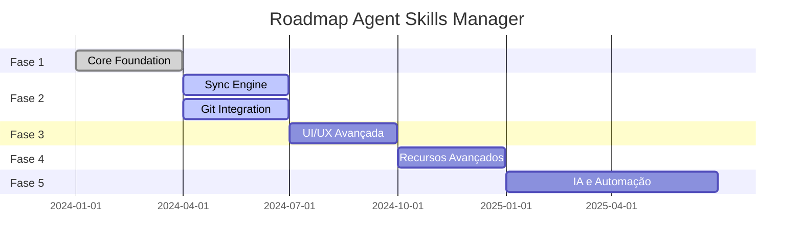

# Fases da Implementação

## Visão Geral do Roadmap

---

## Fase 1 - Core Foundation ✅

**Status**: ✅ Concluído

**Período**: Q1 2024

### Entregas

- ✅ Estrutura extensão VS Code
- ✅ Webview (React + TypeScript)
- ✅ Path resolver
- ✅ TreeView
- ✅ Configuração JSON
- ✅ VS Code API integration

### Critérios de Aceite

- [x] Extensão carrega no VS Code
- [x] Webview renderiza corretamente
- [x] TreeView navega por skills/agents
- [x] Configuração é lida/salva
- [x] Message passing funciona

### Lições Aprendidas

- **pnpm workspaces**: Escolha correta para monorepo
- **React 19**: Funciona bem com Vite
- **TypeScript**: Type sharing entre extension/webview é essencial

---

## Fase 2 - Sincronização e Git 🔄

**Status**: 🔄 Em desenvolvimento

**Período**: Q2 2024

### Entregas

#### Sync Engine
- [ ] Detecção de mudanças
- [ ] Comparação de hashes (SHA-256)
- [ ] Coordenação de cópia
- [ ] Integração com file watcher

#### Detecção de Conflitos
- [ ] Comparação por timestamp
- [ ] Comparação por hash
- [ ] Verificação de merge base no Git
- [ ] Classificação de tipos de conflito

#### Merge Automático
- [ ] Merge de arquivos diferentes
- [ ] Merge de linhas diferentes
- [ ] Detecção de conflitos semânticos
- [ ] Fallback para intervenção humana

#### Integração Git
- [ ] Auto-commit após sync
- [ ] Auto-pull antes do sync
- [ ] Push automático
- [ ] Tratamento de erros de rede
- [ ] Retry com backoff exponencial

#### Histórico de Operações
- [ ] Log de operações realizadas
- [ ] Audit trail de mudanças
- [ ] Rollback de operações

### Dependências

- Schema Zod de configuração ✅
- Path resolver funcional ✅
- Git operations implementadas

### Riscos

- **Conflitos complexos**: Podem exigir intervenção manual frequente
- **Performance**: Hash calculation pode ser lento para arquivos grandes
- **Git errors**: Merge conflicts no repositório central

### Mitigações

- Implementar dry-run mode para preview
- Cache de hashes para arquivos não modificados
- Notificações claras para intervenção do usuário

---

## Fase 3 - UI/UX Avançada 📋

**Status**: 📋 Planejado

**Período**: Q3 2024

### Entregas

#### Editor Visual
- [ ] Editor de skills (drag-and-drop)
- [ ] Preview em tempo real
- [ ] Validação de schema inline
- [ ] Syntax highlighting
- [ ] Auto-complete para metadata

#### Preview de Changes
- [ ] Lista de arquivos modificados
- [ ] Diff viewer integrado
- [ ] Estatísticas de mudanças
- [ ] Confirmação antes de sync

#### Melhorias de Navegação
- [ ] Busca em skills/agents
- [ ] Filtros por tag/categoria
- [ ] Favorites/pinned items
- [ ] Breadcrumbs de navegação

#### Feedback Visual
- [ ] Status indicators (synced, modified, conflict)
- [ ] Progress indicators para operações longas
- [ ] Toast notifications
- [ ] Error boundaries

### Dependências

- Sync engine funcional (Fase 2)
- Schema validation robusta

---

## Fase 4 - Recursos Avançados 📋

**Status**: 📋 Planejado

**Período**: Q4 2024

### Entregas

#### Templates e Presets
- [ ] Biblioteca de templates de skills
- [ ] Presets por linguagem/framework
- [ ] Import/export de configurações
- [ ] Community templates (futuro)

#### Multi-Workspace
- [ ] Gerenciamento de múltiplos destinos
- [ ] Sync seletivo por workspace
- [ ] Perfis de configuração
- [ ] Sync em segundo plano

#### Colaboração
- [ ] Compartilhamento de skills via Git
- [ ] Code review de skills
- [ ] Versionamento semântico

## Referências

- [Criterios de Aceite](./02-criterios-aceite.md) - Métricas detalhadas
- [Decisões de Features](../features/01-decisoes-features.md) - Priorização
