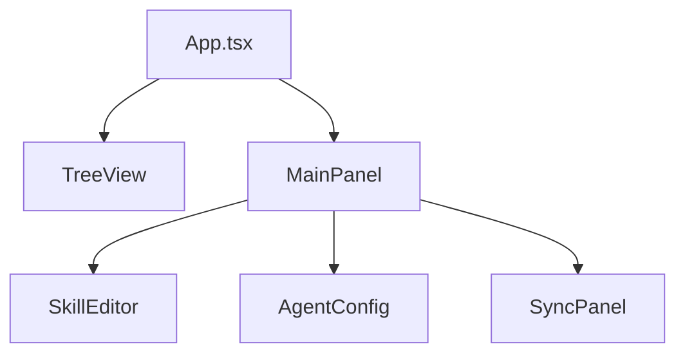

## Especificação de Features

Este documento detalha as features selecionadas para implementação, incluindo requisitos, critérios de aceite e prioridades.

---

## Decisões de Planejamento

Resumo das decisões tomadas na seção de planejamento (Visão Geral, Padrões, Testes, Observabilidade, Sync Flow, Configuração e Decisões de Features).

- **Gerenciamento de pacotes**: usar `pnpm` workspaces para gerenciar múltiplos pacotes e compartilhar dependências.
- **Validação de schema**: usar `zod` como fonte de verdade para validação em runtime e integração com TypeScript (schemas em `shared/types.ts`).
- **Segurança**: modelo permissivo com avisos — validar/sanitizar paths, warn em operações perigosas e pedir confirmação para ações destrutivas.
- **Testes**: foco em testes unitários para funções críticas (Path resolver, Sync engine, Zod, Git ops) usando `vitest`; E2E e testes de integração ficam fora do escopo inicial.
- **Observabilidade**: logging estruturado via Output Channel do VS Code com levels (`error`, `warn`, `info`, `debug`); sem telemetria.
- **Configuração**: suporte a config global (`~/.vscode/extensions/agent-skills-manager/config.json`) e workspace (`.vscode/agent-skills-manager.json`); `agent` default é `copilot`.
- **Fluxo de sincronização**: debounce de 500ms para auto-sync; direção padrão `bidirectional`; suporte a `push`/`pull`/`bidirectional` por config.
- **Detecção de conflitos**: combinação de `mtime` + SHA-256 do conteúdo + verificação de merge-base via Git para identificar conflitos.
- **Merge automático**: suportar merges simples (arquivos diferentes, mudanças em linhas diferentes, idempotência); exigir intervenção humana para mesmas linhas, delete vs modify e conflitos semânticos.
- **Operações Git automáticas**: auto-pull antes do sync e auto-commit + push após (com retry/backoff e tratamento de erros de rede); mensagens de commit padronizadas (`sync: Update patterns from [workspace]`).
- **Escopo excluído inicial**: marketplace, analytics, skill composer visual e portable packages — podem ser revisitados futuramente.
- **Prioridades e próximos passos**: implementar Fase 2 (sync + Git), definir schemas Zod, criar base de testes unitários, implementar logging estruturado, desenvolver templates (Fase 3) e suporte multi-agent (Fase 4).


## Fase 2 - Sincronização e Git 🔄

### 2.1 - Sync Engine Bidirecional

**Descrição**: Mecanismo de sincronização de arquivos entre workspaces usando Git como backend.

**Requisitos**:
- Suporte a sync push, pull e bidirecional
- Detecção automática de mudanças (file watcher)
- Debounce de 500ms para evitar syncs múltiplos
- Configuração por workspace (`.vscode/agent-skills-manager.json`)

**Critérios de Aceite**:
- [ ] Sync manual via command palette funciona
- [ ] Auto-sync detecta e sincroniza mudanças
- [ ] Configuração de direção (push/pull/bidirectional) é respeitada
- [ ] Múltiplos workspaces sincronizam corretamente

**Prioridade**: 🔴 Alta

---

### 2.2 - Detecção de Conflitos

**Descrição**: Identificar conflitos entre versões de arquivos antes do sync.

**Algoritmo**:
1. Comparar timestamps (mtime)
2. Calcular hash SHA-256 do conteúdo
3. Se hash diferente → conflito potencial
4. Verificar ancestral comum no Git

**Critérios de Aceite**:
- [ ] Conflitos detectados com > 95% precisão
- [ ] Falsos positivos < 5%
- [ ] Performance: < 100ms para 100 arquivos

**Prioridade**: 🔴 Alta

---

### 2.3 - Merge Automático

**Descrição**: Resolver automaticamente conflitos simples sem intervenção do usuário.

**Casos Suportados**:
- Arquivos diferentes modificados
- Mesmas modificações (idempotente)
- Mudanças em linhas diferentes

**Requer Intervenção**:
- Mesma linha modificada
- Arquivo deletado vs modificado
- Conflitos semânticos

**Critérios de Aceite**:
- [ ] Merge automático resolve 70%+ dos conflitos
- [ ] Intervenção humana solicitada corretamente
- [ ] Nenhum dado é perdido sem aviso

**Prioridade**: 🟡 Média

---

### 2.4 - Git Integration

**Descrição**: Operações Git automáticas (commit, push, pull).

**Operações**:
```bash
# Auto-commit após sync
git add .
git commit -m "sync: Update patterns from [workspace]"
git push origin main

# Auto-pull antes do sync
git pull origin main
```

**Critérios de Aceite**:
- [ ] Commits automáticos com mensagens descritivas
- [ ] Push/pull funcionam sem intervenção
- [ ] Tratamento de erros de rede
- [ ] Retry com backoff exponencial (3 tentativas)

**Prioridade**: 🔴 Alta

---

### 2.5 - Testes Unitários

**Descrição**: Suite de testes para funções críticas.

**Cobertura**:
- Path resolver (100%)
- Sync engine (90%)
- Validação Zod (100%)
- Git operations (80% com mocks)

**Stack**:
- Vitest (runner)
- Mocks para Git e filesystem

**Critérios de Aceite**:
- [ ] Coverage total ≥ 80%
- [ ] Tests executam em < 30s
- [ ] CI integra testes no pipeline

**Prioridade**: 🟡 Média

---

## Fase 3 - UI/UX Avançada 📋

### 3.1 - Template Library (Embutida)

**Descrição**: Coleção de templates pré-construídos para agents comuns.

**Templates Incluídos**:
1. **Copilot - Code Review**
2. **Copilot - Refactoring**
3. **Copilot - Documentation**
4. **Claude - Analysis**
5. **Claude - Creative Writing**
6. **Claude - Code Generation**
7. **Generic - Project Setup**
8. **Generic - Meeting Notes**
9. **Generic - Learning Notes**
10. **Generic - Task Planning**

**Requisitos**:
- Templates embutidos no código da extensão
- Atualizáveis via update da extensão
- Categoria por agent (Copilot, Claude, Generic)
- Preview do template antes de aplicar

**Critérios de Aceite**:
- [ ] 10+ templates disponíveis
- [ ] Picker de templates na UI
- [ ] Aplicação em 1 clique
- [ ] Preview do conteúdo
- [ ] Busca/filtro por categoria

**Prioridade**: 🟢 Baixa (mas importante para onboarding)

---

### 3.2 - Diff Viewer para Conflitos

**Descrição**: Interface visual para comparar versões em conflito.

**Features**:
- Side-by-side diff (local vs remoto)
- Highlight de linhas modificadas
- Botões "Aceitar Local", "Aceitar Remoto", "Merge Manual"
- Merge editor integrado

**Critérios de Aceite**:
- [ ] Diff claro e legível
- [ ] Resolução em ≤3 cliques
- [ ] Integração com Merge Editor do VS Code

**Prioridade**: 🟡 Média

---

### 3.3 - Preview de Changes

**Descrição**: Mostrar mudanças antes de aplicar sync.

**Informações**:
- Lista de arquivos modificados
- Tipo de mudança (adicionado, modificado, deletado)
- Tamanho da mudança
- Conflitos potenciais

**Critérios de Aceite**:
- [ ] Preview antes de sync manual
- [ ] Contagem clara de mudanças
- [ ] Opção de cancelar

**Prioridade**: 🟡 Média

---

## Fase 4 - Recursos Avançados 🚀

### 4.1 - Multi-Agent Orchestration (Manual)

**Descrição**: Suporte nativo a múltiplos agents (Copilot, Claude, etc.) com seleção manual.

**Requisitos**:
- Configuração de agent por skill
- Configuração de agent por workspace
- Fallback para agent padrão
- Validação de compatibilidade

**Configuração**:
```json
{
  "defaultAgent": "copilot",
  "skills": {
    "code-review": {
      "agent": "claude"
    },
    "documentation": {
      "agent": "copilot"
    }
  }
}
```

**Critérios de Aceite**:
- [ ] Suporte a 2+ agents simultâneos
- [ ] Seleção manual funciona
- [ ] Fallback para padrão quando não configurado
- [ ] Validação de schema por agent

**Prioridade**: 🟢 Baixa (diferencial, mas não crítico)

---

### 4.2 - Skill Testing Framework (Sintaxe)

**Descrição**: Validação de formato e estrutura de skills antes de aplicar.

**Validações**:
- Schema Zod (estrutura obrigatória)
- Tipos de dados corretos
- Campos obrigatórios presentes
- Formatação válida (YAML/JSON)

**Exemplo**:
```typescript
const SkillSchema = z.object({
  name: z.string().min(1),
  description: z.string(),
  instructions: z.string(),
  examples: z.array(z.string()).optional(),
  metadata: z.object({
    agent: z.enum(['copilot', 'claude']),
    version: z.string(),
  }),
});
```

**Critérios de Aceite**:
- [ ] Validação antes de aplicar skill
- [ ] Erros claros e acionáveis
- [ ] Sugestões de correção
- [ ] Performance: < 50ms por validação

**Prioridade**: 🟡 Média

---

### 4.3 - Logging Estruturado

**Descrição**: Sistema de logs para debugging e troubleshooting.

**Levels**:
- `error`: Erros críticos
- `warn`: Avisos importantes
- `info`: Informações gerais
- `debug`: Detalhes para debugging

**Output**:
- VS Code Output Channel
- Arquivo de log (opcional, configurável)

**Exemplo**:
```
[INFO] 2024-04-07 10:30:00 - Sync started for workspace: /home/user/project
[DEBUG] 2024-04-07 10:30:01 - Detected 3 changed files
[WARN] 2024-04-07 10:30:02 - Conflict detected: skills/react.md
[INFO] 2024-04-07 10:30:03 - Sync completed successfully
```

**Critérios de Aceite**:
- [ ] Logs estruturados e legíveis
- [ ] Debug mode ativável via setting
- [ ] Performance: logging não impacta sync
- [ ] Rotação de logs (máx 10MB)

**Prioridade**: 🟡 Média

---

## Fase 5 - Inteligência e Automação 🧠

### 5.1 - AI-Powered Conflict Resolution

**Descrição**: Usar IA para sugerir resolução de conflitos.

**Fluxo**:
1. Detectar conflito
2. Enviar contexto para LLM
3. Receber sugestão de merge
4. Usuário aceita ou rejeita
5. Aprendizado com feedback

**Requisitos**:
- Integração com LLM (Claude, GPT, etc.)
- Contexto mínimo necessário
- Sugestões em < 5s
- Privacidade (não enviar código sensível)

**Critérios de Aceite**:
- [ ] Sugestões úteis em 70%+ dos casos
- [ ] Performance: < 5s por sugestão
- [ ] Usuário pode desabilitar
- [ ] Privacidade respeitada

**Prioridade**: 🔵 Futuro (depende de validação)

---

## Componentes UI

### Stack

- React 19 + TypeScript
- Vite (build)
- Webview VS Code

### Arquitetura



### Componentes

#### App.tsx
- Root component
- Estado global
- Roteamento
- Theme provider

#### TreeView
- Navegação hierárquica (skills/agents)
- Expansão/recolhimento de nós
- Seleção múltipla

**Estrutura**:
```
📁 Skills/
  ├── 📁 react/
  └── 📁 python/
📁 Agents/
```

**Interações**:
- Click → Seleciona
- Double-click → Abre editor
- Right-click → Menu de contexto

#### AgentConfig

- Seletor de agent (copilot/claude)
- Configurações globais
- Settings do VS Code integration

### VS Code API

#### Message Passing

```typescript
// Webview → Extension
vscode.postMessage({ type: 'SYNC_REQUEST', payload: { destination: 'workspace-1' } })

// Extension → Webview
window.addEventListener('message', event => {
  const { type, payload } = event.data
})
```

---

## Roadmap

### Fase 1 - Core Foundation ✅

**Status**: Concluído

**Entregas**:
- Estrutura extensão VS Code
- Webview (React + TypeScript)
- Path resolver
- TreeView
- Configuração JSON
- VS Code API integration

### Fase 2 - Sincronização e Git 🔄

**Status**: Em desenvolvimento

**Entregas**:
- Sync engine
- Detecção de conflitos
- Merge automático
- Integração Git
- File watcher (auto-sync)
- Histórico de operações

**Critérios de aceite**:
- Sync entre 2+ workspaces
- Detecção correta de conflitos
- Resolução automática (conflitos simples)
- Git commits automáticos
- Auto-sync configurável

### Fase 3 - UI/UX Avançada 📋

**Status**: Planejado

**Entregas**:
- Editor visual (drag-and-drop)
- Preview de changes
- Diff viewer (conflitos)
- Templates de skills
- Search global (fuzzy matching)
- Atalhos customizáveis

**Componentes**:
- SkillTemplatePicker
- ConflictDiffViewer
- GlobalSearchBar

### Fase 4 - Recursos Avançados 🚀

**Status**: Planejado

**Entregas**:
- Multi-agent orchestration (manual)
- Skill testing framework (sintaxe)
- Template library (embutida)
- Version history viewer
- Export/Import (backup)
- Cloud sync (opcional)

### Fase 5 - Inteligência e Automação 🧠

**Status**: Futuro

**Entregas**:
- AI-powered conflict resolution
- Skill composition avançada
- Smart recommendations
- Auto-complete de blocos
- Pattern detection
