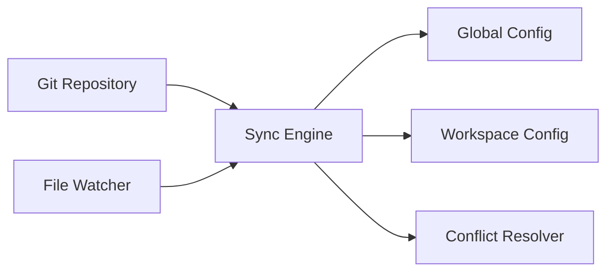
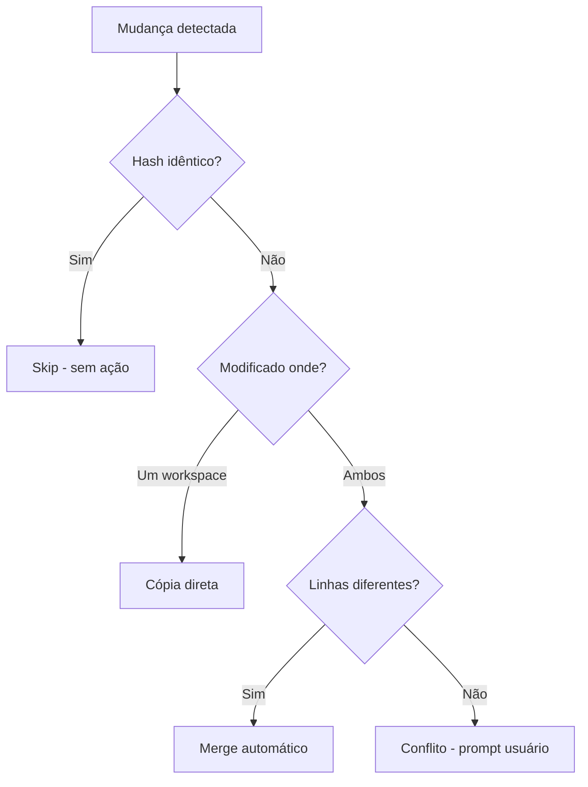

# Sync Engine

O **Sync Engine** é o componente responsável por sincronizar skills entre o repositório Git e os destinos de configuração (global e workspace). Ele detecta mudanças, resolve conflitos e aplica políticas de sincronização de forma automática ou manual.

## Status da Implementação

⚠️ **PLANEJADO** - Esta funcionalidade está documentada através dos ADRs, mas a implementação ainda não foi iniciada. A extensão atualmente possui apenas estrutura básica em `extension/src/extension.ts`.

## Arquitetura



### Componentes Principais

- **Sync Engine**: Orquestra todo o processo de sincronização
- **File Watcher**: Detecta mudanças em arquivos automaticamente
- **Conflict Resolver**: Resolve conflitos entre versões
- **Hash Calculator**: Calcula SHA-256 para detecção de mudanças
- **Retry Manager**: Gerencia tentativas com backoff exponencial

## API Prevista

```typescript
interface SyncEngine {
  /**
   * Sincroniza skills do Git para os destinos
   * @returns Relatório de operações executadas
   */
  sync(options?: SyncOptions): Promise<SyncResult>;

  /**
   * Habilita/desabilita auto-sync via file watcher
   */
  setAutoSync(enabled: boolean): void;

  /**
   * Força sincronização manual
   */
  forceSync(): Promise<SyncResult>;

  /**
   * Visualiza preview de mudanças antes de aplicar
   */
  previewChanges(): Promise<ChangePreview>;
}

interface SyncOptions {
  /**
   * Destinos para sincronização
   * @default ['global', 'workspace']
   */
  targets?: Array<'global' | 'workspace'>;

  /**
   * Modo de resolução de conflitos
   * @default 'manual'
   */
  conflictResolution?: 'auto' | 'manual';

  /**
   * Habilita auto-commit após sync
   * @default true
   */
  autoCommit?: boolean;
}

interface SyncResult {
  success: boolean;
  operations: SyncOperation[];
  conflicts: Conflict[];
  errors: SyncError[];
}

interface SyncOperation {
  type: 'copy' | 'merge' | 'delete' | 'rename';
  source: string;
  target: string;
  status: 'success' | 'failed' | 'skipped';
}
```

## Fluxo de Sincronização

### 1. Detecção de Mudanças

O Sync Engine utiliza estratégia híbrida para otimizar performance (ver [ADR-008](../adr/ADR-008-hash-strategy.md)):

1. **Fast Path**: Compara timestamp + tamanho do arquivo
2. **Se iguais**: Assume sem mudança e pula sincronização
3. **Se diferentes**: Calcula SHA-256 para confirmar mudança real
4. **Decisão**: Compara hashes para determinar ação

```typescript
async function detectChanges(file: string): Promise<ChangeType> {
  const stats = await fs.stat(file);
  
  // Fast path: timestamp + size
  if (isSameTimestampAndSize(stats, cache.get(file))) {
    return ChangeType.NoChange;
  }
  
  // Slow path: hash verification
  const currentHash = await calculateSHA256(file);
  const cachedHash = cache.get(file)?.hash;
  
  if (currentHash === cachedHash) {
    return ChangeType.NoChange;
  }
  
  return ChangeType.Modified;
}
```

### 2. Validação de Arquivos

- Verifica se skill está no formato correto
- Valida metadados e estrutura
- Ignora arquivos temporários e builds

### 3. Aplicação de Políticas

O Sync Engine aplica as seguintes políticas automaticamente:

#### Política de Retry ([ADR-010](../adr/ADR-010-retry-policy.md))

Para operações de rede (Git push, pull), aplica backoff exponencial:

- **Tentativa 1**: Imediata
- **Tentativa 2**: Após 2 segundos
- **Tentativa 3**: Após 4 segundos
- **Tentativa 4**: Após 8 segundos
- **Falha final**: Notifica usuário (~14s total)

```typescript
async function retryWithBackoff<T>(
  operation: () => Promise<T>,
  maxRetries = 3
): Promise<T> {
  for (let i = 0; i <= maxRetries; i++) {
    try {
      return await operation();
    } catch (error) {
      if (i === maxRetries || !isRetryable(error)) {
        throw error;
      }
      const delay = Math.pow(2, i) * 2000; // 2s, 4s, 8s
      await sleep(delay);
    }
  }
}
```

#### Política de Delete/Rename ([ADR-011](../adr/ADR-011-delete-rename-policy.md))

Operações destrutivas sempre requerem confirmação:

1. Detecta operação destrutiva (delete ou rename)
2. Mostra preview detalhado ao usuário
3. Aguarda confirmação explícita
4. Executa apenas após aprovação

**Importante**: Não existe opção de auto-aprovação para máxima segurança.

### 4. Cópia para Destinos

Após validação e aplicação de políticas:

1. Copia skills para destinos configurados
2. Registra operação no histórico
3. Aplica auto-commit (se habilitado)
4. Notifica usuário sobre resultado

## AutoSync

Por padrão, o AutoSync está **habilitado** ([ADR-006](../adr/ADR-006-auto-sync-default.md)):

```typescript
// Configuração padrão
{
  autoSync: true,  // Habilitado por padrão
  syncDebounce: 500  // 500ms de debounce
}
```

### Comportamento

- **File Watcher** monitora mudanças no repositório Git
- **Debounce de 500ms** evita syncs excessivos durante edições
- **Sincronização automática** mantém destinos atualizados
- **Desabilitar**: Configure `autoSync: false` para controle manual

### Indicadores Visuais

Quando AutoSync estiver implementado, indicadores visuais mostrarão:
- ✅ Status de sincronização
- 🔄 Sincronização em progresso
- ⚠️ Conflitos detectados
- ❌ Erros de sincronização

## Resolução de Conflitos

O Sync Engine implementa estratégia de **auto-merge conservador** ([ADR-003](../adr/ADR-003-sync-strategy.md)):

### Tipos de Conflito

| Tipo | Descrição | Resolução |
|------|-----------|-----------|
| `same` | Hash SHA-256 idêntico | Skip (sem ação) |
| `different` | Modificado em apenas um workspace | Cópia direta |
| `different (merge)` | Linhas diferentes no mesmo arquivo | Merge linha a linha |
| `conflict` | Mesma linha modificada em ambos | Intervenção manual |

### Fluxo de Resolução



### Princípios

- **Conservador**: Qualquer ambiguidade vira conflito manual
- **Seguro**: Nunca perde dados sem confirmação
- **Rastreável**: Histórico completo de decisões
- **Claro**: Usuário sempre sabe quando precisa intervir

## Integração Git

### Operações Suportadas

- ✅ **Auto-commit**: Após cada sync bem-sucedido
- 🔧 **Auto-push**: Configurável via settings
- ❌ **Auto-pull**: NUNCA automático ([ADR-009](../adr/ADR-009-git-pull-policy.md))

### Rationale para Pull Manual

O usuário deve fazer `git pull` manualmente para:
- Manter controle total do workflow Git
- Evitar sobrescrever work in progress
- Prevenir conflitos inesperados
- Comportamento previsível

## Histórico e Auditoria

Todas as operações são registradas:

```typescript
interface SyncLog {
  timestamp: Date;
  operation: SyncOperation;
  user?: string;
  result: 'success' | 'failed' | 'cancelled';
  details: string;
}
```

- **Audit trail** completo de mudanças
- **Timestamps** para rastreabilidade
- **Rollback** via histórico Git (`git revert` ou `git reset`)

## Performance

### Otimizações Implementadas

1. **Estratégia Híbrida** ([ADR-008](../adr/ADR-008-hash-strategy.md)):
   - Fast path: timestamp + size (95% dos casos)
   - Slow path: SHA-256 apenas quando necessário
   
2. **Cache de Hashes**:
   - Evita recalcular hashes repetidamente
   - Invalida cache baseado em timestamp
   
3. **Debounce**:
   - Agrupa múltiplas mudanças em um sync
   - Reduz I/O e operações desnecessárias

### Métricas

- Abordagem qualitativa: sem lag perceptível na UI
- Benchmark será definido em cenários específicos quando necessário
- Otimizações aplicadas conforme demanda real

## Referências

### ADRs Relacionados

- [ADR-003: Estratégia de Sincronização](../adr/ADR-003-sync-strategy.md)
- [ADR-006: AutoSync Habilitado por Padrão](../adr/ADR-006-auto-sync-default.md)
- [ADR-008: Estratégia Híbrida de Hash](../adr/ADR-008-hash-strategy.md)
- [ADR-009: Política de Git Pull Manual](../adr/ADR-009-git-pull-policy.md)
- [ADR-010: Política de Retry com Backoff](../adr/ADR-010-retry-policy.md)
- [ADR-011: Política de Delete/Rename](../adr/ADR-011-delete-rename-policy.md)

### Implementação

- **Localização prevista**: `extension/src/sync/`
- **Status atual**: Não implementado (estrutura básica em `extension/src/extension.ts`)
- **Documentação de planejamento**: [Sincronização](../../02-development/02-implementacao/02-sincronizacao.md)
