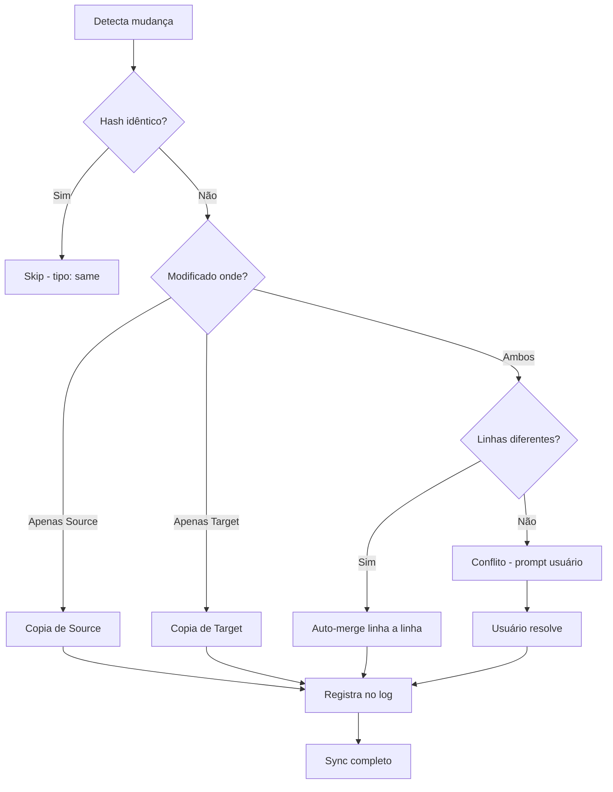

# Sync Strategies

Este documento detalha as estratégias de sincronização do Sync Engine, baseadas no [ADR-003: Estratégia de Sincronização](../adr/ADR-003-sync-strategy.md).

## Status da Implementação

⚠️ **PLANEJADO** - Definido através de ADR, aguardando implementação.

## Visão Geral

O Sync Engine precisa detectar mudanças, resolver conflitos e sincronizar arquivos entre múltiplos workspaces e o repositório Git central. A estratégia escolhida é **auto-merge conservador com fallback manual**.

## Tipos de Conflito

O sistema classifica conflitos em três categorias:

### 1. `same` - Arquivos Idênticos

**Critério**: Hash SHA-256 idêntico entre origem e destino.

**Resolução**: Skip (nenhuma ação necessária).

```typescript
if (sourceHash === targetHash) {
  return ConflictType.Same;
}
```

**Exemplo**:
```
Git:       skill-a.yaml (hash: abc123)
Global:    skill-a.yaml (hash: abc123)
Ação:      Skip - arquivos já sincronizados
```

### 2. `different` - Alterações Não-Sobrepostas

**Critério**: Arquivo modificado em apenas um local, OU modificações em linhas diferentes.

**Resolução**: 
- Se modificado em apenas um workspace → cópia direta
- Se modificações em linhas diferentes → merge linha a linha automático

```typescript
if (modifiedInOneWorkspaceOnly(file)) {
  return ConflictType.Different; // Copy directly
}

if (modificationsOnDifferentLines(file)) {
  return ConflictType.Different; // Auto-merge
}
```

**Exemplo 1 - Cópia Direta**:
```
Git:       skill-a.yaml (modificado hoje)
Global:    skill-a.yaml (modificado há 3 dias)
Ação:      Copia de Git → Global
```

**Exemplo 2 - Merge Automático**:
```
Git:
  line 1: title: My Skill
  line 2: description: Old description  ← modificado no Git
  line 3: version: 1.0.0

Global:
  line 1: title: My Skill
  line 2: description: Old description
  line 3: version: 2.0.0                 ← modificado no Global

Ação: Merge automático
  line 1: title: My Skill
  line 2: description: Old description
  line 3: version: 2.0.0
```

### 3. `conflict` - Conflito Real

**Critério**: Mesma linha modificada em ambos os workspaces, ou ambiguidade na detecção.

**Resolução**: Intervenção manual obrigatória.

```typescript
if (sameLineModifiedInBoth(file)) {
  return ConflictType.Conflict; // Requires user intervention
}
```

**Exemplo**:
```
Git:
  line 2: description: New Git description  ← modificado no Git

Global:
  line 2: description: New Global description  ← modificado no Global

Ação: Prompt usuário para escolher versão ou fazer merge manual
```

## Estratégia de Merge

### Auto-Merge Conservador

A estratégia escolhida prioriza **segurança** sobre **conveniência**:

#### Princípios

1. **Auto-merge apenas quando seguro**:
   - Alterações em linhas diferentes
   - Sem sobreposição de blocos
   - Sem ambiguidade na detecção

2. **Qualquer ambiguidade → conflito manual**:
   - Mesma linha modificada
   - Blocos adjacentes modificados
   - Estrutura do arquivo alterada

3. **Rastreabilidade completa**:
   - Todas as decisões registradas em log
   - Histórico de operações mantido
   - Audit trail para troubleshooting

#### Algoritmo

```typescript
async function resolveConflict(
  source: FileContent,
  target: FileContent
): Promise<MergeResult> {
  // 1. Comparar hashes
  if (source.hash === target.hash) {
    return { type: 'same', action: 'skip' };
  }

  // 2. Verificar modificação única
  if (!target.modified && source.modified) {
    return { type: 'different', action: 'copy', from: 'source' };
  }
  
  if (!source.modified && target.modified) {
    return { type: 'different', action: 'copy', from: 'target' };
  }

  // 3. Ambos modificados - tentar merge
  const lineByLine = compareLineByLine(source.content, target.content);
  
  if (lineByLine.hasConflict) {
    return { 
      type: 'conflict', 
      action: 'manual',
      conflicts: lineByLine.conflicts 
    };
  }

  // 4. Merge automático possível
  return {
    type: 'different',
    action: 'merge',
    result: lineByLine.merged
  };
}
```

### Merge Linha a Linha

Para arquivos com modificações não-sobrepostas:

```typescript
function compareLineByLine(
  source: string[],
  target: string[]
): MergeResult {
  const result: string[] = [];
  const conflicts: Conflict[] = [];
  
  const maxLines = Math.max(source.length, target.length);
  
  for (let i = 0; i < maxLines; i++) {
    const sourceLine = source[i];
    const targetLine = target[i];
    
    if (sourceLine === targetLine) {
      // Linha idêntica - usa qualquer uma
      result.push(sourceLine);
    } else if (!sourceLine) {
      // Linha adicionada no target
      result.push(targetLine);
    } else if (!targetLine) {
      // Linha adicionada no source
      result.push(sourceLine);
    } else {
      // Conflito - ambos modificaram a mesma linha
      conflicts.push({
        line: i + 1,
        source: sourceLine,
        target: targetLine
      });
    }
  }
  
  return {
    merged: result,
    hasConflict: conflicts.length > 0,
    conflicts
  };
}
```

## Alternativas Consideradas

### ❌ Opção 1: Merge Agressivo

```typescript
// Sempre tenta fazer merge, até em casos ambíguos
strategy: 'aggressive'
```

**Prós**:
- Menos intervenção manual
- Mais conveniente para o usuário
- Workflow mais fluido

**Contras**:
- ⚠️ **Risco de perda de dados**
- Pode sobrescrever mudanças importantes
- Difícil de debugar quando dá errado

**Decisão**: ❌ Rejeitado - segurança é mais importante que conveniência.

### ✅ Opção 2: Auto-Merge Conservador (ESCOLHIDA)

```typescript
// Merge apenas quando seguro, fallback para manual
strategy: 'conservative'
```

**Prós**:
- ✅ Seguro - nunca perde dados sem aviso
- ✅ Claro - usuário sabe quando precisa intervir
- ✅ Rastreável - histórico de decisões

**Contras**:
- Pode requerer intervenção manual frequente
- Complexidade de implementação

**Decisão**: ✅ **APROVADO** - balanceamento ideal entre segurança e usabilidade.

### ❌ Opção 3: Sempre Manual

```typescript
// Sempre pergunta ao usuário, mesmo para casos simples
strategy: 'manual'
```

**Prós**:
- Máximo controle para o usuário
- Zero risco de perda de dados

**Contras**:
- ⚠️ Friction muito alto
- Usuário cansado de responder prompts
- Má experiência de usuário

**Decisão**: ❌ Rejeitado - muito invasivo.

## Fluxo de Sincronização



## Tratamento de Conflitos Manuais

Quando um conflito manual é detectado:

### 1. Notificação ao Usuário

```typescript
interface ConflictNotification {
  title: string;
  message: string;
  files: ConflictFile[];
  actions: ConflictAction[];
}

const notification: ConflictNotification = {
  title: 'Conflito de Sincronização',
  message: '2 arquivos têm conflitos que requerem sua atenção',
  files: [
    {
      path: 'skill-a.yaml',
      conflicts: 1,
      preview: '...'
    }
  ],
  actions: [
    { label: 'Resolver Agora', handler: openConflictEditor },
    { label: 'Ver Detalhes', handler: showConflictDetails },
    { label: 'Adiar', handler: snoozeConflict }
  ]
};
```

### 2. Interface de Resolução

- Diff side-by-side mostrando ambas as versões
- Opções: "Usar Source", "Usar Target", "Editar Manualmente"
- Preview do resultado antes de aplicar
- Histórico de decisões anteriores

### 3. Aplicação da Resolução

```typescript
async function applyResolution(
  file: string,
  resolution: ConflictResolution
): Promise<void> {
  // Aplica resolução escolhida
  await fs.writeFile(file, resolution.content);
  
  // Registra decisão no log
  await logOperation({
    type: 'conflict_resolution',
    file,
    resolution: resolution.type,
    timestamp: Date.now()
  });
  
  // Notifica sucesso
  showNotification('Conflito resolvido', 'success');
}
```

## Histórico de Operações

Todas as decisões de merge são registradas:

```typescript
interface SyncOperation {
  id: string;
  timestamp: Date;
  type: 'same' | 'different' | 'conflict';
  action: 'skip' | 'copy' | 'merge' | 'manual';
  files: string[];
  result: 'success' | 'failed' | 'cancelled';
  user?: string;
  details: string;
}
```

### Exemplo de Log

```json
{
  "id": "sync-001",
  "timestamp": "2026-04-08T10:30:00Z",
  "type": "different",
  "action": "merge",
  "files": ["skill-a.yaml", "skill-b.yaml"],
  "result": "success",
  "details": "Auto-merged 2 files with non-overlapping changes"
}
```

## Testes de Cenários

### Cenários de Teste Previstos

1. **Teste: Arquivos Idênticos**
   - Setup: Mesmo conteúdo em ambos workspaces
   - Esperado: Skip sync

2. **Teste: Modificação Única**
   - Setup: Arquivo modificado apenas no Git
   - Esperado: Cópia direta para Global

3. **Teste: Merge Automático**
   - Setup: Linhas diferentes modificadas
   - Esperado: Merge linha a linha bem-sucedido

4. **Teste: Conflito Real**
   - Setup: Mesma linha modificada em ambos
   - Esperado: Prompt para resolução manual

5. **Teste: Blocos Adjacentes**
   - Setup: Modificações em blocos adjacentes
   - Esperado: Conflito manual (conservador)

## Consequências da Decisão

### Positivas ✅

- **Segurança**: Nunca perde dados sem confirmação explícita
- **Clareza**: Usuário sempre sabe quando precisa intervir
- **Rastreabilidade**: Histórico completo de operações
- **Previsibilidade**: Comportamento consistente e documentado

### Negativas ⚠️

- **Intervenção Manual**: Pode requerer ação do usuário frequentemente em ambientes colaborativos
- **Complexidade**: Implementação do merge engine é mais complexa
- **Falsos Positivos**: Pode classificar alguns casos seguros como conflitos

## Referências

- [ADR-003: Estratégia de Sincronização](../adr/ADR-003-sync-strategy.md)
- [ADR-008: Estratégia Híbrida de Hash](../adr/ADR-008-hash-strategy.md)
- [Sync Engine](./04-sync-engine.md)
- [Hash Strategy](./06-hash-strategy.md)
