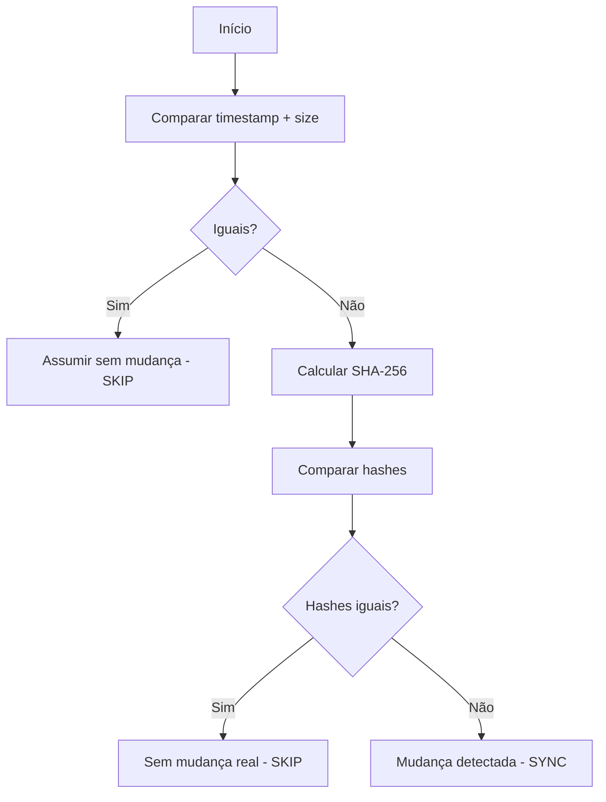

# Hash Strategy

Este documento detalha a estratégia híbrida de detecção de mudanças do Sync Engine, baseada no [ADR-008: Estratégia Híbrida de Hash](../adr/ADR-008-hash-strategy.md).

## Status da Implementação

⚠️ **PLANEJADO** - Definido através de ADR, aguardando implementação.

## Visão Geral

O Sync Engine precisa detectar mudanças em arquivos de forma eficiente e precisa. A estratégia híbrida combina a **velocidade do timestamp** com a **precisão do SHA-256**, otimizando o caso comum (sem mudanças) sem sacrificar a confiabilidade.

## Problema

Três abordagens comuns para detecção de mudanças:

| Estratégia | Precisão | Performance | Problemas |
|------------|----------|-------------|-----------|
| **Timestamp** | ~95% | ⚡ Muito rápida | False positives/negatives |
| **SHA-256** | 100% | 🐌 Lenta para arquivos grandes | I/O intensivo |
| **Git diff** | 100% | 🐌 Muito lenta | Dependência do Git |

**Objetivo**: Combinar o melhor dos dois mundos.

## Estratégia Híbrida

### Algoritmo



### Implementação Prevista

```typescript
interface FileMetadata {
  path: string;
  size: number;
  mtime: Date;
  hash?: string;
}

interface HashCache {
  [filePath: string]: {
    size: number;
    mtime: number;
    hash: string;
  };
}

class ChangeDetector {
  private cache: HashCache = {};

  /**
   * Detecta se arquivo mudou usando estratégia híbrida
   */
  async detectChange(filePath: string): Promise<boolean> {
    const stats = await fs.stat(filePath);
    const cached = this.cache[filePath];

    // Fast path: timestamp + size
    if (cached && this.isSameMetadata(stats, cached)) {
      return false; // Sem mudança
    }

    // Slow path: hash verification
    const currentHash = await this.calculateHash(filePath);

    if (cached?.hash === currentHash) {
      // Metadata diferente mas conteúdo igual (false positive)
      // Atualiza cache com novo metadata
      this.updateCache(filePath, stats, currentHash);
      return false;
    }

    // Mudança real detectada
    this.updateCache(filePath, stats, currentHash);
    return true;
  }

  /**
   * Verifica se metadata é idêntico (fast path)
   */
  private isSameMetadata(
    stats: fs.Stats,
    cached: HashCache[string]
  ): boolean {
    return (
      stats.size === cached.size &&
      stats.mtimeMs === cached.mtime
    );
  }

  /**
   * Calcula SHA-256 hash do arquivo
   */
  private async calculateHash(filePath: string): Promise<string> {
    const content = await fs.readFile(filePath);
    return crypto
      .createHash('sha256')
      .update(content)
      .digest('hex');
  }

  /**
   * Atualiza cache com novos valores
   */
  private updateCache(
    filePath: string,
    stats: fs.Stats,
    hash: string
  ): void {
    this.cache[filePath] = {
      size: stats.size,
      mtime: stats.mtimeMs,
      hash
    };
  }

  /**
   * Limpa cache para forçar recálculo
   */
  clearCache(filePath?: string): void {
    if (filePath) {
      delete this.cache[filePath];
    } else {
      this.cache = {};
    }
  }
}
```

## Fluxo Detalhado

### 1. Fast Path - Timestamp + Size

**Quando**: Primeira verificação, maioria dos casos.

**Operações**:
```typescript
// Leitura de metadata apenas (muito rápido)
const stats = await fs.stat(filePath);

// Comparação em memória (instantâneo)
if (stats.size === cached.size && stats.mtime === cached.mtime) {
  return false; // Skip sync
}
```

**Performance**: ~1ms por arquivo (I/O mínimo).

**Cobertura**: ~95% dos casos em ambiente típico.

### 2. Slow Path - SHA-256 Verification

**Quando**: Metadata diferente detectado.

**Operações**:
```typescript
// Leitura completa do arquivo (lento para arquivos grandes)
const content = await fs.readFile(filePath);

// Cálculo do hash (CPU-bound)
const hash = crypto.createHash('sha256').update(content).digest('hex');

// Comparação de hashes (instantâneo)
if (hash === cachedHash) {
  return false; // False positive - sem mudança real
}
```

**Performance**: ~10ms a ~1000ms dependendo do tamanho do arquivo.

**Cobertura**: ~5% dos casos restantes.

## Cenários de Uso

### Cenário 1: Arquivo Não Modificado (Fast Path)

```
Arquivo: skill-a.yaml
Cache:   size=1024, mtime=1625097600, hash=abc123
Atual:   size=1024, mtime=1625097600

Fluxo:
1. Compara metadata ✅ IGUAL
2. Resultado: Sem mudança (skip)

Tempo: ~1ms
I/O: Minimal (stat apenas)
```

### Cenário 2: Touch Sem Mudança de Conteúdo (Slow Path)

```
Arquivo: skill-b.yaml
Cache:   size=2048, mtime=1625097600, hash=def456
Atual:   size=2048, mtime=1625097700 (tocado)

Fluxo:
1. Compara metadata ❌ DIFERENTE (mtime)
2. Calcula SHA-256: def456
3. Compara hash ✅ IGUAL
4. Atualiza cache com novo mtime
5. Resultado: Sem mudança (skip)

Tempo: ~10ms
I/O: Leitura completa do arquivo
```

### Cenário 3: Mudança Real no Conteúdo (Slow Path)

```
Arquivo: skill-c.yaml
Cache:   size=512, mtime=1625097600, hash=ghi789
Atual:   size=520, mtime=1625097800 (modificado)

Fluxo:
1. Compara metadata ❌ DIFERENTE (size + mtime)
2. Calcula SHA-256: jkl012
3. Compara hash ❌ DIFERENTE
4. Atualiza cache com novos valores
5. Resultado: Mudança detectada (sync)

Tempo: ~15ms
I/O: Leitura completa do arquivo
```

## Cache Management

### Estrutura do Cache

```typescript
interface HashCacheEntry {
  size: number;        // Tamanho em bytes
  mtime: number;       // Timestamp de modificação (ms)
  hash: string;        // SHA-256 hash do conteúdo
  lastCheck: number;   // Último check (para TTL)
}

const cache: Map<string, HashCacheEntry> = new Map();
```

### Persistência

O cache deve ser persistido para sobreviver restarts:

```typescript
class PersistentHashCache {
  private cachePath: string;
  private cache: Map<string, HashCacheEntry>;

  constructor(workspacePath: string) {
    this.cachePath = path.join(workspacePath, '.vscode', 'sync-cache.json');
    this.cache = this.loadCache();
  }

  private loadCache(): Map<string, HashCacheEntry> {
    try {
      const data = fs.readFileSync(this.cachePath, 'utf8');
      const entries = JSON.parse(data);
      return new Map(Object.entries(entries));
    } catch {
      return new Map();
    }
  }

  async saveCache(): Promise<void> {
    const entries = Object.fromEntries(this.cache);
    await fs.writeFile(
      this.cachePath,
      JSON.stringify(entries, null, 2),
      'utf8'
    );
  }

  // Salva automaticamente a cada 5 minutos ou 100 mudanças
  private scheduleSave(): void {
    setInterval(() => this.saveCache(), 5 * 60 * 1000);
  }
}
```

### Invalidação

Cache deve ser invalidado quando:

```typescript
// 1. Arquivo deletado
watcher.on('delete', (file) => {
  cache.clearCache(file);
});

// 2. Git pull ou checkout
git.on('pull', () => {
  cache.clearCache(); // Limpa todo o cache
});

// 3. Comando manual de limpeza
vscode.commands.registerCommand('skills.clearCache', () => {
  cache.clearCache();
  vscode.window.showInformationMessage('Cache limpo');
});

// 4. Cache muito antigo (TTL de 30 dias)
cache.cleanup((entry) => {
  const age = Date.now() - entry.lastCheck;
  return age > 30 * 24 * 60 * 60 * 1000;
});
```

## Alternativas Consideradas

### ❌ Opção 1: SHA-256 Sempre

```typescript
// Sempre calcula hash, sem fast path
async function detectChange(file: string): Promise<boolean> {
  const hash = await calculateSHA256(file);
  return hash !== cachedHash;
}
```

**Prós**:
- ✅ 100% precisão
- ✅ Simples de implementar
- ✅ Detecta qualquer mudança

**Contras**:
- ❌ Lento para arquivos grandes
- ❌ I/O intensivo
- ❌ Não escala bem

**Decisão**: ❌ Rejeitado - performance inaceitável para uso contínuo.

### ❌ Opção 2: Timestamp + Size Apenas

```typescript
// Apenas metadata, sem verificação de hash
async function detectChange(file: string): Promise<boolean> {
  const stats = await fs.stat(file);
  return stats.size !== cached.size || stats.mtime !== cached.mtime;
}
```

**Prós**:
- ✅ Muito rápido
- ✅ Baixo I/O
- ✅ Escalável

**Contras**:
- ❌ ~5% de false positives/negatives
- ❌ Não detecta touches ou rollbacks
- ❌ Não confiável

**Decisão**: ❌ Rejeitado - precisão é essencial para sincronização.

### ✅ Opção 3: Híbrido (ESCOLHIDA)

```typescript
// Fast path com fallback para hash
async function detectChange(file: string): Promise<boolean> {
  if (sameMetadata) return false;
  const hash = await calculateSHA256(file);
  return hash !== cachedHash;
}
```

**Prós**:
- ✅ Rápido na maioria dos casos (~95%)
- ✅ Preciso quando necessário
- ✅ Escalável

**Contras**:
- ⚠️ Complexidade adicional
- ⚠️ Requer cache persistente

**Decisão**: ✅ **APROVADO** - melhor balanceamento.

## Performance Esperada

### Benchmarks Estimados

```
Cenário: 100 arquivos, sem mudanças
- Fast path: 100 x 1ms = 100ms total
- SHA-256 always: 100 x 15ms = 1.5s total
- Ganho: 15x mais rápido

Cenário: 100 arquivos, 5 mudanças reais
- Fast path: 95 x 1ms = 95ms
- Slow path: 5 x 15ms = 75ms
- Total: 170ms
- SHA-256 always: 1.5s
- Ganho: 9x mais rápido
```

### Métricas para Coletar

Quando implementado, coletar:

```typescript
interface PerformanceMetrics {
  totalChecks: number;
  fastPathHits: number;      // Metadata match
  slowPathHits: number;      // Hash calculated
  falsePositives: number;    // Metadata diff, hash same
  averageFastPathTime: number;  // ms
  averageSlowPathTime: number;  // ms
}
```

## Edge Cases

### 1. Timestamp Impreciso

**Problema**: Sistemas de arquivos com resolução de timestamp baixa.

**Solução**: SHA-256 detecta corretamente mesmo com timestamp igual.

### 2. Arquivo Muito Grande

**Problema**: SHA-256 pode demorar muito (>1s para arquivos >100MB).

**Solução**: 
- Skills geralmente são pequenos (<100KB)
- Se necessário: chunks + hashing incremental
- Se necessário: timeout com fallback para "assume mudança"

### 3. Cache Desatualizado

**Problema**: Cache pode ficar dessincroni se modificações externas.

**Solução**:
- TTL de 30 dias
- Invalidação em eventos conhecidos (git pull, etc)
- Comando manual de limpeza

### 4. Falha ao Calcular Hash

**Problema**: Arquivo pode ser deletado ou locked durante cálculo.

**Solução**:
```typescript
try {
  const hash = await calculateSHA256(file);
  return hash !== cachedHash;
} catch (error) {
  if (error.code === 'ENOENT') {
    // Arquivo deletado - reportar como mudança
    return true;
  }
  // Outro erro - assume mudança por segurança
  logger.warn(`Failed to hash ${file}:`, error);
  return true;
}
```

## Consequências

### Positivas ✅

- **Performance Otimizada**: Fast path para maioria dos casos
- **Precisão Garantida**: Hash confirma mudanças reais
- **Escalável**: Funciona bem com muitos arquivos
- **Confiável**: Detecta mudanças corretamente

### Negativas ⚠️

- **Complexidade**: Implementação mais complexa que alternativas
- **Cache Management**: Requer manutenção de cache persistente
- **False Positives Temporários**: Metadata pode indicar mudança quando não há (resolvido por hash)
- **Timestamps Enganosos**: Touches sem mudança causam cálculo desnecessário de hash

### Mitigações

- Cache persistente bem implementado
- TTL e invalidação adequados
- Métricas para monitorar performance
- Logs para debugging

## Referências

- [ADR-008: Estratégia Híbrida de Hash](../adr/ADR-008-hash-strategy.md)
- [ADR-003: Estratégia de Sincronização](../adr/ADR-003-sync-strategy.md)
- [Sync Engine](./04-sync-engine.md)
- [Sync Strategies](./05-sync-strategies.md)
