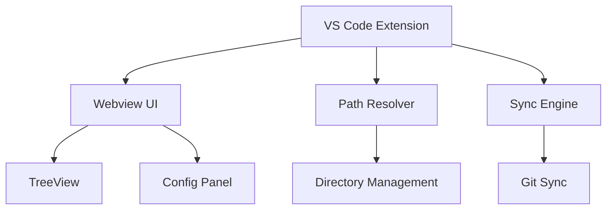

# Estado Atual da Implementação

**Última Atualização**: Abril de 2026

**Status Geral**: Fase 1 (Core Foundation) parcialmente implementada. Estrutura de pastas e configurações criadas, código principal pendente de implementação.

---

## Resumo Executivo

O **Agent Skills Manager** é uma extensão VS Code para gerenciar e sincronizar skills de agentes de IA (Copilot, Claude) entre múltiplos workspaces. O projeto está organizado em monorepo com pnpm workspaces.

### Progresso Atual

| Fase                        | Status               | Progresso | Período           |
| --------------------------- | -------------------- | --------- | ----------------- |
| Fase 1 - Core Foundation    | 🟡 Em desenvolvimento | ~18%      | Q1 2024 - Q2 2026 |
| Fase 2 - Sincronização      | 🔴 Não iniciado       | 0%        | Q2-Q3 2026        |
| Fase 3 - UI/UX Avançada     | 🔴 Não iniciado       | 0%        | Q3 2024           |
| Fase 4 - Recursos Avançados | 🔴 Não iniciado       | 0%        | Q4 2024           |

---

## Status por Pacote

### Extension (`extension/`) 🟡

**Status**: Estrutura criada, implementação pendente

| Componente          | Status | Detalhes                       |
| ------------------- | ------ | ------------------------------ |
| Estrutura de pastas | ✅      | Configurada                    |
| `package.json`      | ✅      | Scripts e dependências         |
| `tsconfig.json`     | ✅      | TypeScript configurado         |
| `esbuild.js`        | ✅      | Build configurado              |
| `src/extension.ts`  | 🟡      | `activate`/`deactivate` vazios |
| Comandos VS Code    | 🔴      | Não registrados                |
| Webview panel       | 🔴      | Não criado                     |
| Message passing     | 🔴      | Não implementado               |

**Scripts Disponíveis**:
- `pnpm dev` - Watch mode
- `pnpm build` - Build production
- `pnpm test` - VS Code test runner (não configurado)

### Webview (`webview/`) 🟡

**Status**: App básico funciona, componentes pendentes

**Stack**: React 19, TypeScript, Vite, shadcn/ui, Tailwind CSS v4

| Componente         | Status | Detalhes                         |
| ------------------ | ------ | -------------------------------- |
| Estrutura          | ✅      | Configurada                      |
| `vite.config.ts`   | ✅      | Build e dev server               |
| `tailwind.config`  | ✅      | Instalado e configurado          |
| `components.json`  | ✅      | shadcn/ui configurado            |
| `src/App.tsx`      | 🟡      | Renderiza básico ("Helou Uordi") |
| `src/main.tsx`     | ✅      | Entry point                      |
| `src/index.css`    | ✅      | Tailwind imports                 |
| `src/lib/utils.ts` | ✅      | `cn()` helper                    |
| `src/components/`  | 🔴      | VAZIO (exceto `ui/`)             |
| TreeView           | 🔴      | Não implementado                 |
| Config Panel       | 🔴      | Não implementado                 |
| Sync Panel         | 🔴      | Não implementado                 |

**Scripts Disponíveis**:
- `pnpm dev` - Vite dev server
- `pnpm build` - Vite build
- `pnpm lint` - Biome lint

### Shared (`shared/`) 🔴

**Status**: Pacote configurado, `src/` completamente vazio

| Componente         | Status | Detalhes                      |
| ------------------ | ------ | ----------------------------- |
| Estrutura          | ✅      | `package.json` e `tsconfig`   |
| `src/`             | 🔴      | **VAZIO**                     |
| `path-resolver.ts` | 🔴      | Documentado, não implementado |
| `types.ts`         | 🔴      | Zod schemas pendentes         |
| `index.ts`         | 🔴      | Exportações pendentes         |

**Dependências Planejadas**:
- `zod` - Validação de schemas (não instalado)

### Documentação (`docusaurus/`) ✅

**Status**: Completa e detalhada

A documentação descreve funcionalidades que **não existem no código**, criando expectativa enganosa sobre o estado do projeto.

---

## Funcionalidades Principais

| Feature          | Status | Implementação | Fase |
| ---------------- | ------ | ------------- | ---- |
| Path Resolver    | 🔴      | 0%            | 1    |
| Config System    | 🔴      | 0%            | 1    |
| Sync Engine      | 🔴      | 0%            | 2    |
| Git Integration  | 🔴      | 0%            | 2    |
| TreeView         | 🔴      | 0%            | 1    |
| Message Passing  | 🔴      | 0%            | 1    |
| Template Library | 🔴      | 0%            | 3    |
| Multi-Agent      | 🔴      | 0%            | 4    |

---

## Arquitetura Atual



### Estrutura de Diretórios

```
agent-skills-manager/
├── extension/        # VS Code extension (Node.js) - 🟡 Parcial
├── webview/          # React UI (TypeScript + Vite) - 🟡 Parcial
├── shared/           # Tipos e utilitários compartilhados - 🔴 Vazio
└── docusaurus/       # Documentação - ✅ Completa
```

---

## O Que Está Implementado

### ✅ Concluído

1. **Estrutura de Pastas**
   - Monorepo com pnpm workspaces configurado
   - Três pacotes: `extension`, `webview`, `shared`

2. **Configuração de Build**
   - Extension: esbuild configurado
   - Webview: Vite configurado com React 19 + TypeScript
   - Tailwind CSS v4 instalado e configurado
   - shadcn/ui inicializado (`components.json`)

3. **Documentação**
   - Docusaurus configurado
   - 17 arquivos de documentação completos
   - Arquitetura, padrões e roadmap bem documentados

4. **Webview Básico**
   - `App.tsx` renderiza componente simples
   - Entry point configurado
   - CSS com Tailwind funcionando

---

## O Que Falta Implementar

### 🔴 Crítico (Fase 1)

1. **Shared Package**
   - Instalar `zod` para validação
   - Implementar `ConfigSchema` em `shared/src/types.ts`
   - Implementar `PathResolver` em `shared/src/path-resolver.ts`
   - Criar `shared/src/index.ts` com exportações

2. **Extension Logic**
   - Implementar `activate()` e `deactivate()` em `extension/src/extension.ts`
   - Registrar comandos VS Code:
     - `agent-skills-manager.sync` - Sincronizar patterns
     - `agent-skills-manager.config` - Abrir configuração
     - `agent-skills-manager.refresh` - Atualizar tree view
   - Criar webview panel
   - Implementar message passing handlers

3. **Webview Components**
   - Criar `TreeView.tsx` - Navegação hierárquica
   - Criar `ConfigPanel.tsx` - Visualização/edição de configuração
   - Criar `SyncPanel.tsx` - Controles de sincronização
   - Implementar estado global
   - Implementar roteamento (se necessário)

4. **Message Passing**
   - Implementar comunicação Webview → Extension
   - Implementar comunicação Extension → Webview
   - Definir tipos de mensagem:
     - `SYNC_PATTERN`, `SYNC_COMPLETE`, `SYNC_ERROR`
     - `CONFIG_UPDATE`, `TREE_REFRESH`, `GET_STATUS`

### 🔴 Fase 2 - Sincronização (Não Iniciado)

1. **Sync Engine**
   - Detecção de mudanças via file watcher
   - Comparação por hash (SHA-256) e timestamp
   - Coordenação de cópia entre workspaces

2. **Conflict Resolver**
   - Detecção de conflitos
   - Merge automático para casos simples
   - Intervenção do usuário para conflitos complexos

3. **Git Integration**
   - Instalar `simple-git`
   - Auto-commit após sync
   - Auto-pull antes do sync
   - Push automático
   - Tratamento de erros com retry

### 🔴 Fase 3 - UI/UX Avançada (Não Iniciado)

- Editor de skills com preview
- Diff viewer integrado
- Busca e filtros
- Status indicators
- Toast notifications
- Error boundaries

### 🔴 Fase 4 - Recursos Avançados (Não Iniciado)

- Template library embutida
- Multi-agent support manual
- Skill testing framework (validação de sintaxe)
- Testes unitários (80%+ cobertura)

---

## Gaps Críticos

### 1. Código Não Implementado

- **Extension**: `activate`/`deactivate` vazios
- **Shared**: `src/` completamente vazio
- **Webview**: `components/` vazio (exceto `ui/`)
- **Testes**: Nenhuma configuração de testes

### 2. Dependências Faltando

- `zod` - Validação de schemas
- `simple-git` - Operações Git
- `vitest` - Testes unitários

### 3. Documentação vs Realidade

A documentação está **completa e bem detalhada**, mas descreve funcionalidades que **não existem no código**. Isso cria uma expectativa enganosa sobre o estado do projeto.

---

## Próximos Passos Prioritários

### Curto Prazo (1-2 semanas)

1. ✅ Instalar Zod e implementar `ConfigSchema`
   ```bash
   pnpm add zod --filter=shared
   ```

2. ✅ Implementar `PathResolver`
   - API: `resolve()`, `normalize()`, `isValid()`, `exists()`

3. ✅ Criar `extension.ts` básico com comandos
   - Registro de comandos
   - Criação de webview
   - Message passing handlers

4. ✅ Implementar message passing mínimo
   - Webview ↔ Extension communication
   - Tipos básicos de mensagem

### Médio Prazo (1 mês)

1. Criar TreeView funcional
2. Implementar Config Panel
3. Configurar testes unitários com Vitest
4. Implementar Sync Engine básico

### Longo Prazo (3 meses)

1. Git integration completa
2. Template library
3. Multi-agent support
4. Advanced UI features

---

## Métricas de Progresso

### Fase 1 - Core Foundation

| Critério              | Target | Atual | Status |
| --------------------- | ------ | ----- | ------ |
| Estrutura de pastas   | 100%   | 100%  | ✅      |
| Configuração de build | 100%   | 100%  | ✅      |
| Extensão funcional    | 100%   | 10%   | 🔴      |
| Webview funcional     | 100%   | 20%   | 🔴      |
| Message passing       | 100%   | 0%    | 🔴      |
| Path resolver         | 100%   | 0%    | 🔴      |
| Config validation     | 100%   | 0%    | 🔴      |

**Progresso Total Fase 1**: ~18%

### Fase 2 - Sincronização

**Progresso**: 0% (Não iniciado)

---

## Riscos e Bloqueadores

### Riscos Atuais

1. **Documentação desatualizada** - Cria expectativas irreais
2. **Escopo grande** - Muitas features planejadas, pouca implementação
3. **Dependências externas** - Zod, simple-git não instalados

### Bloqueadores

Nenhum bloqueador técnico identificado. O projeto precisa de **implementação focada**.

---

## Dependências Faltando

| Dependência  | Purpose              | Status        |
| ------------ | -------------------- | ------------- |
| `zod`        | Validação de schemas | Não instalado |
| `simple-git` | Operações Git        | Não instalado |
| `vitest`     | Testes unitários     | Não instalado |

---

## Recomendações

### Curto Prazo (1-2 semanas)

1. ✅ Instalar Zod e implementar `ConfigSchema`
2. ✅ Implementar `PathResolver`
3. ✅ Criar `extension.ts` básico com comandos
4. ✅ Implementar message passing mínimo

### Médio Prazo (1 mês)

1. Criar TreeView funcional
2. Implementar Config Panel
3. Configurar testes unitários
4. Implementar Sync Engine básico

### Longo Prazo (3 meses)

1. Git integration completa
2. Template library
3. Multi-agent support
4. Advanced UI features
