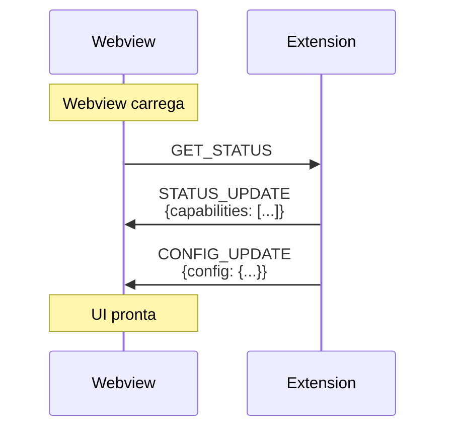
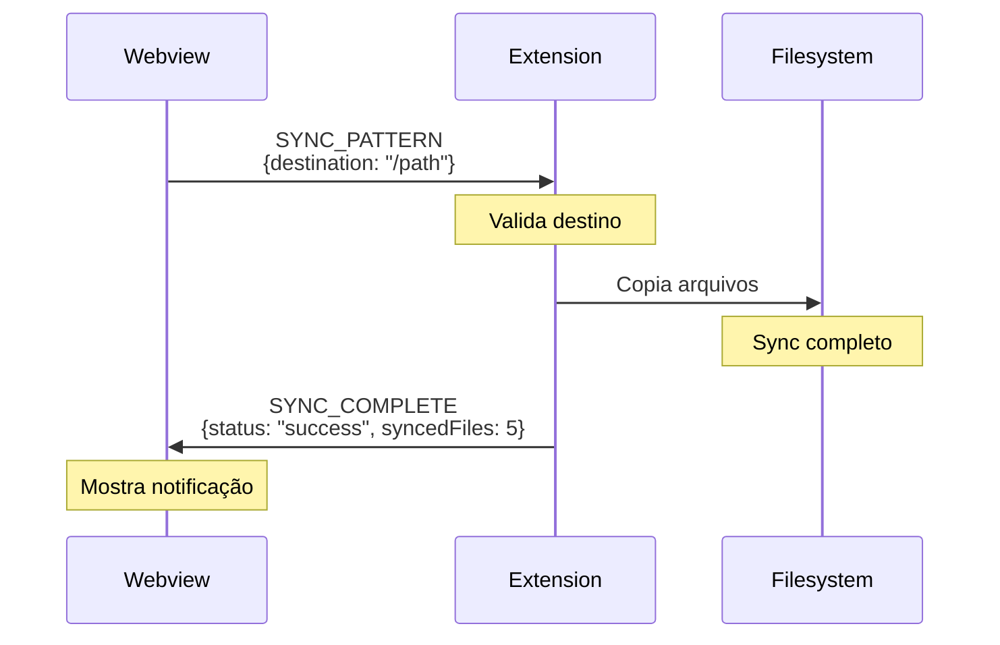
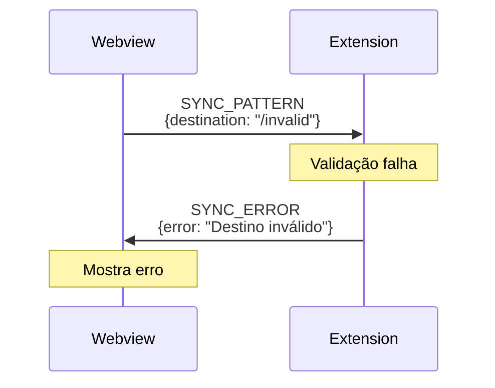
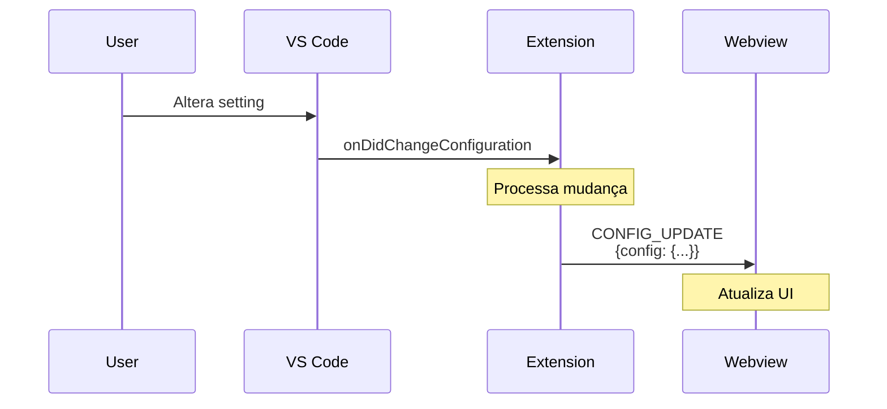
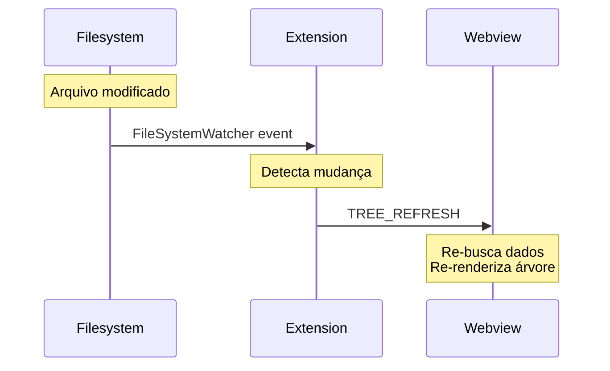
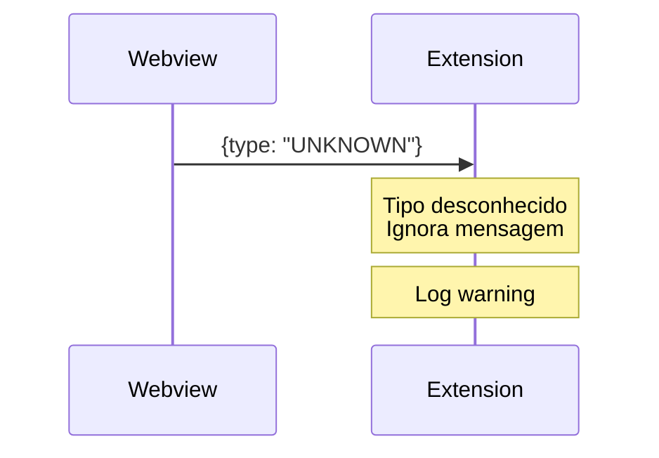
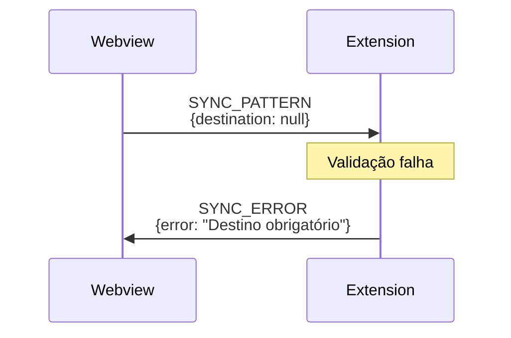
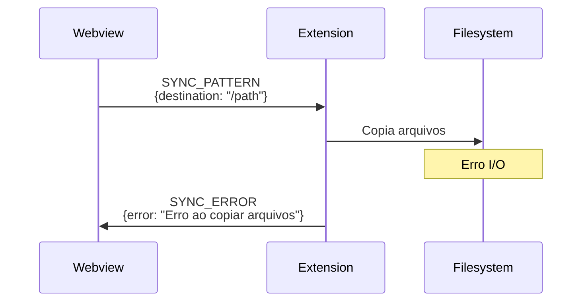

## Visão Geral

Este documento descreve os fluxos de comunicação típicos entre Extension e Webview, ilustrando sequências de mensagens para casos de uso comuns.

## Ciclo de Vida da Webview

### Inicialização



**Passos**:
1. Webview monta componente React
2. Envia `GET_STATUS` para obter estado inicial
3. Extension responde com capabilities e configuração
4. UI habilita features conforme capabilities

## Fluxos de Operação

### Sincronização de Pattern

Fluxo de sucesso:



**Tratamento de Erro**:



### Atualização de Configuração



### Refresh de Árvore (File Watcher)



## Padrões de Comunicação

### Request-Response

Webview solicita informação, extension responde:

```
Webview: GET_STATUS
Extension: STATUS_UPDATE
```

### Fire-and-Forget

Extension notifica webview sem esperar resposta:

```
Extension: TREE_REFRESH
```

### Request-Multiple-Responses

Uma requisição pode gerar múltiplas respostas:

```
Webview: SYNC_PATTERN
Extension: SYNC_COMPLETE (ou SYNC_ERROR)
Extension: TREE_REFRESH (se necessário)
```

## Error Handling

### Mensagem Malformada



### Payload Inválido



### Operação Falha



## Casos de Uso Completos

### 1. Usuário Sincroniza Pattern

```
1. [User] Clica em "Sync Pattern" na UI
2. [Webview] Valida input, envia SYNC_PATTERN
3. [Extension] Valida destino
4. [Extension] Executa sync
5. [Extension] Envia SYNC_COMPLETE ou SYNC_ERROR
6. [Webview] Mostra resultado
7. [Extension] Detecta mudanças (FileWatcher)
8. [Extension] Envia TREE_REFRESH
9. [Webview] Atualiza árvore
```

### 2. Usuário Muda Configuração

```
1. [User] Abre VS Code settings
2. [User] Altera preferência da extension
3. [VS Code] Notifica extension via onDidChangeConfiguration
4. [Extension] Processa mudança
5. [Extension] Envia CONFIG_UPDATE para webview
6. [Webview] Aplica nova configuração na UI
```

### 3. Desenvolvedor Adiciona Skill Manualmente

```
1. [Developer] Cria arquivo em .agents/skills/
2. [FileSystem] Arquivo criado
3. [Extension] FileWatcher detecta mudança
4. [Extension] Envia TREE_REFRESH
5. [Webview] Re-busca lista de skills
6. [Webview] Re-renderiza árvore com nova skill
```

## Timing e Performance

### Timeouts

⚠️ **Não definido**: Sistema de timeouts para operações longas.

Considerações futuras:
- Operações > 5s devem mostrar progress
- Timeout de 30s para operações síncronas
- Mensagens de progresso para operações longas

### Debouncing

Para evitar flood de mensagens:

- **TREE_REFRESH**: Debounce de 500ms (múltiplas mudanças de arquivo)
- **CONFIG_UPDATE**: Debounce de 200ms (múltiplas settings)

### Batching

⚠️ **Não implementado**: Envio em lote de múltiplas mensagens.

## Debugging

### Logs

Ambos os lados devem logar mensagens:

```typescript
// Extension
console.log('[Extension -> Webview]', message.type);

// Webview
console.log('[Webview -> Extension]', message.type);
```

### DevTools

Webview pode ser inspecionada:
- **Command Palette**: "Developer: Open Webview Developer Tools"
- Inspecionar mensagens no console
- Breakpoints em handlers

## Estado e Sincronização

### Source of Truth

- **Extension**: Possui o estado autoritativo
- **Webview**: Mantém cache local otimista
- **Sincronização**: Webview sempre busca estado inicial com `GET_STATUS`

### Consistency

- Webview não assume sucesso (aguarda confirmação)
- Extension envia `TREE_REFRESH` após mudanças
- Conflitos são resolvidos na extension

## Implementação

### Status Atual

- **Protocolo**: ✅ Definido em ADR-002
- **Fluxos**: ✅ Documentados
- **Handlers**: ⚠️ Não implementados
- **Testes**: ⚠️ Não implementados

### Próximos Passos

1. Implementar handlers básicos (GET_STATUS, STATUS_UPDATE)
2. Implementar SYNC_PATTERN + respostas
3. Implementar FileWatcher + TREE_REFRESH
4. Adicionar error handling robusto
5. Criar testes de integração para cada fluxo

## Referências

- [ADR-002: Message Passing Protocol](../adr/ADR-002-message-passing-protocol.md)
- [Message Protocol](./01-message-protocol.md)
- [Message Types](./02-message-types.md)
- [VS Code Webview Guide](https://code.visualstudio.com/api/extension-guides/webview)
