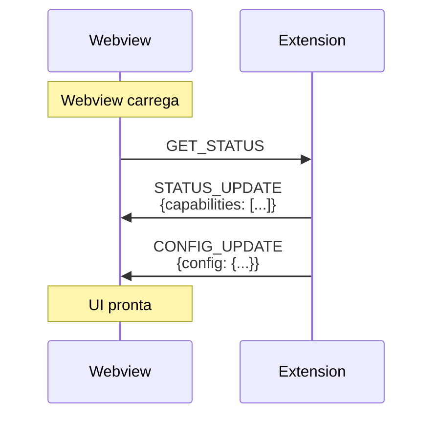
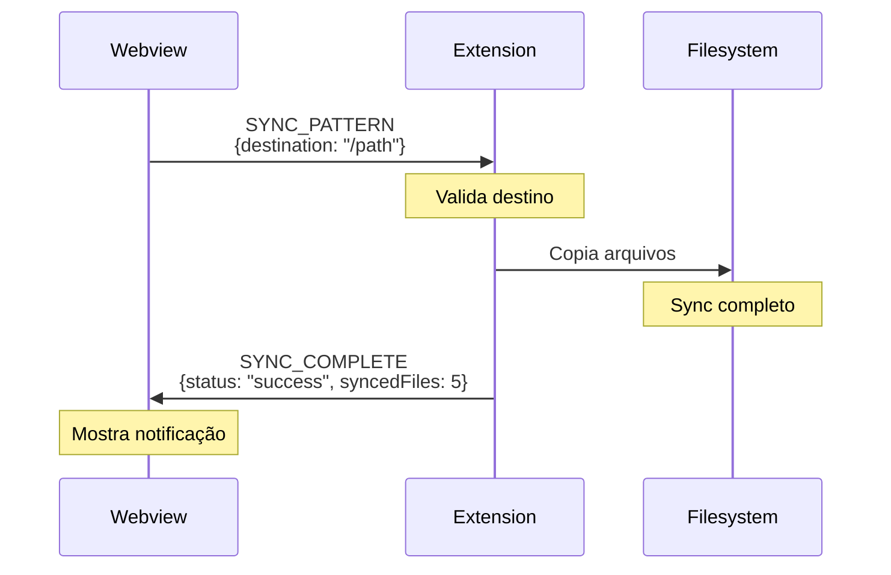
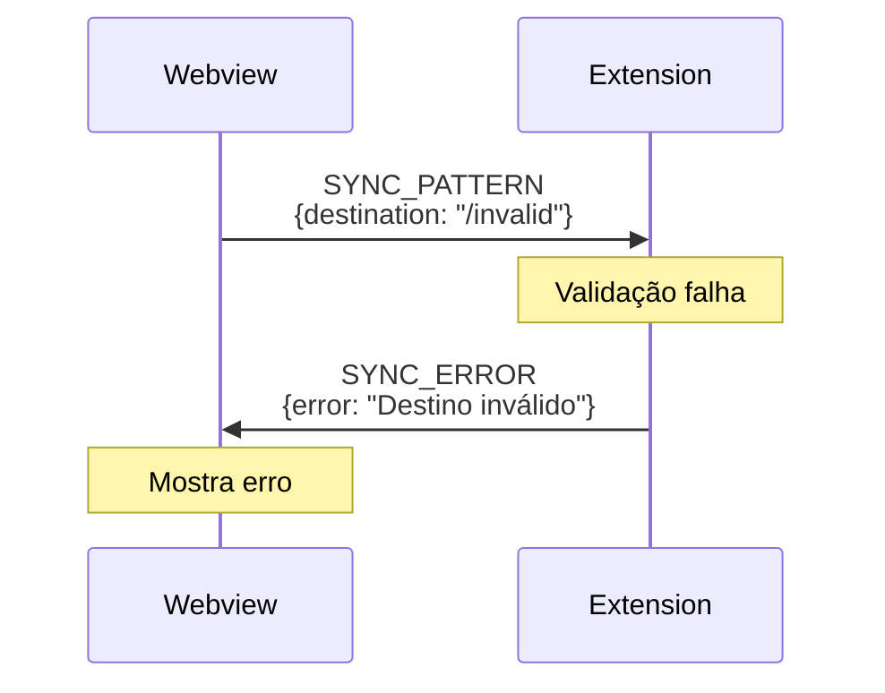
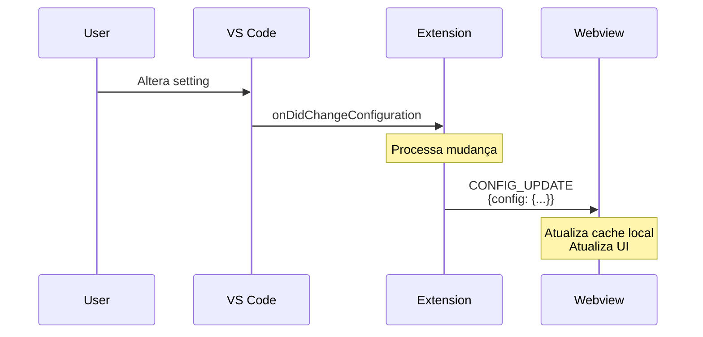
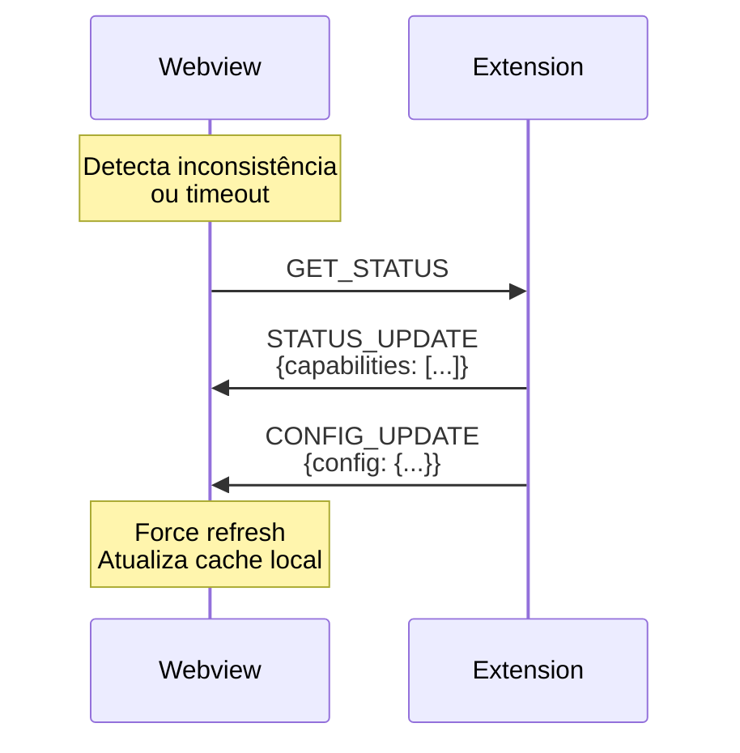
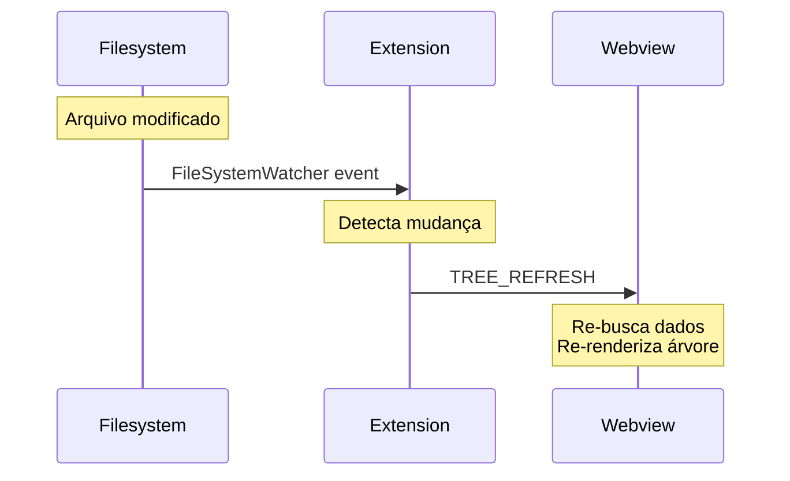
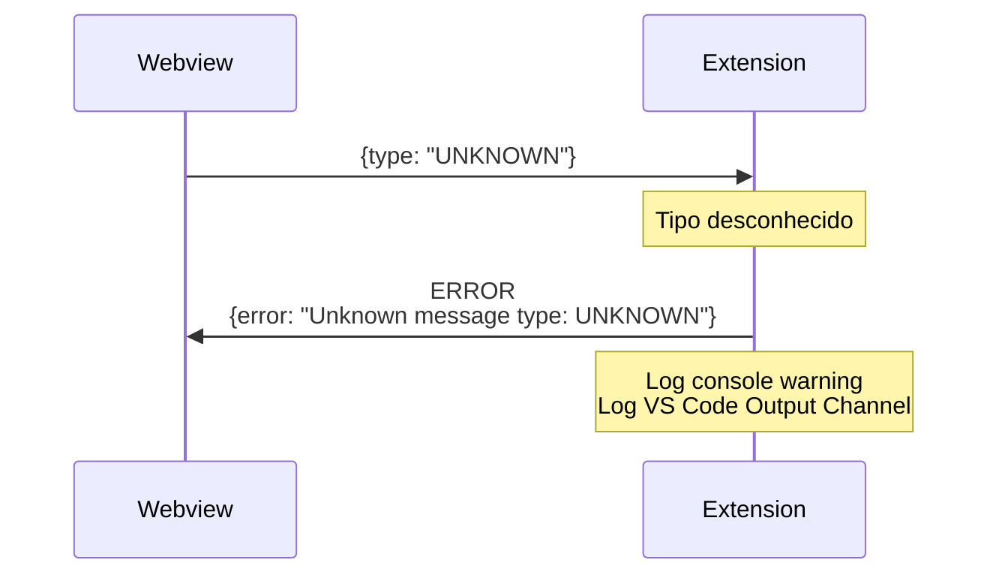
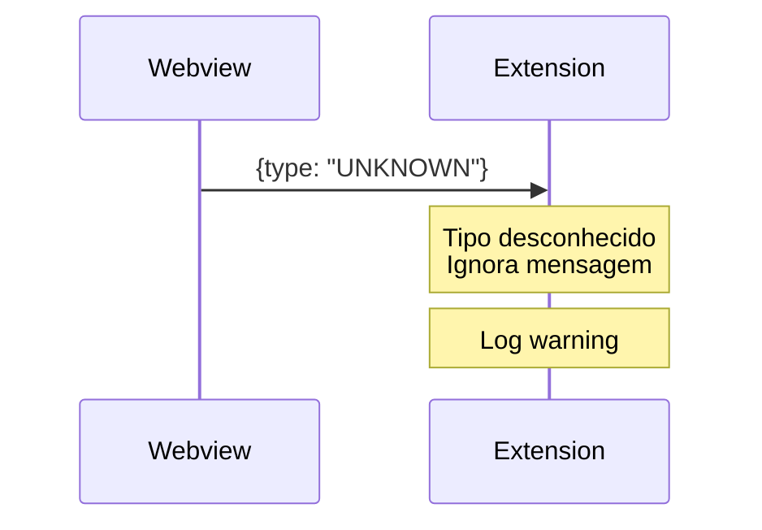
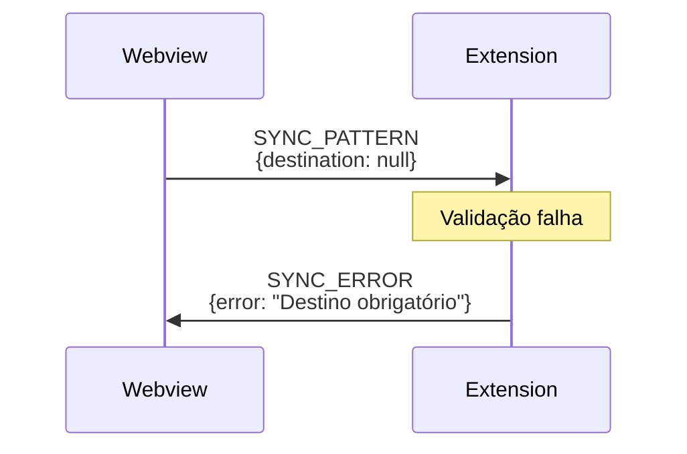
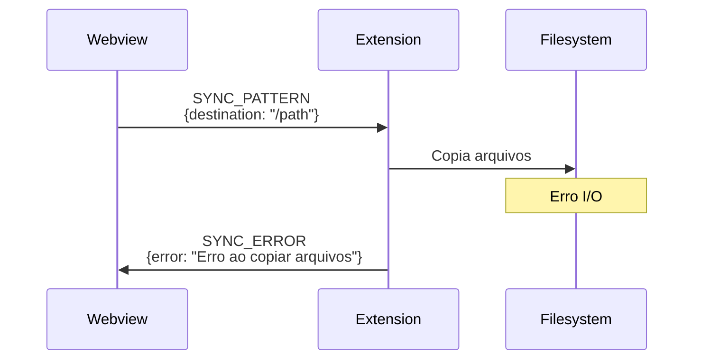

## Visão Geral

Este documento descreve os fluxos de comunicação típicos entre Extension e Webview, ilustrando sequências de mensagens para casos de uso comuns.

## Ciclo de Vida da Webview

### Inicialização



**Passos**:
1. Webview monta componente React
2. Envia `GET_STATUS` para obter estado inicial
3. Extension responde com capabilities e configuração
4. UI habilita features conforme capabilities

## Fluxos de Operação

### Sincronização de Pattern

Fluxo de sucesso:



**Tratamento de Erro**:



### Atualização de Configuração

**Mecanismo Normal (Push)**:



**Mecanismo de Recovery (Pull)**:

Se webview perder sync ou suspeitar que configuração está desatualizada:



**Cache Local Otimista**:
- Webview mantém cache local da configuração
- Atualiza imediatamente ao receber `CONFIG_UPDATE`
- Em caso de dúvida, força refresh via `GET_STATUS`
- Extension é sempre a source of truth

### Refresh de Árvore (File Watcher)



## Padrões de Comunicação

### Request-Response

Webview solicita informação, extension responde:

```
Webview: GET_STATUS
Extension: STATUS_UPDATE
```

### Fire-and-Forget

Extension notifica webview sem esperar resposta:

```
Extension: TREE_REFRESH
```

### Request-Multiple-Responses

Uma requisição pode gerar múltiplas respostas:

```
Webview: SYNC_PATTERN
Extension: SYNC_COMPLETE (ou SYNC_ERROR)
Extension: TREE_REFRESH (se necessário)
```

## Error Handling

### Unknown Message Type

Quando a extension recebe uma mensagem com tipo desconhecido:



**Comportamento**:
- Extension responde com mensagem `ERROR` (tipo a ser adicionado ao protocolo)
- Logging duplo:
  - Console warning para debug durante desenvolvimento
  - VS Code Output Channel para diagnóstico em produção
- Sem rate limiting: cada mensagem desconhecida gera erro individual

**Mensagem Malformada**



### Payload Inválido



### Operação Falha



## Casos de Uso Completos

### 1. Usuário Sincroniza Pattern

```
1. [User] Clica em "Sync Pattern" na UI
2. [Webview] Valida input, envia SYNC_PATTERN
3. [Extension] Valida destino
4. [Extension] Executa sync
5. [Extension] Envia SYNC_COMPLETE ou SYNC_ERROR
6. [Webview] Mostra resultado
7. [Extension] Detecta mudanças (FileWatcher)
8. [Extension] Envia TREE_REFRESH
9. [Webview] Atualiza árvore
```

### 2. Usuário Muda Configuração

```
1. [User] Abre VS Code settings
2. [User] Altera preferência da extension
3. [VS Code] Notifica extension via onDidChangeConfiguration
4. [Extension] Processa mudança
5. [Extension] Envia CONFIG_UPDATE para webview
6. [Webview] Aplica nova configuração na UI
```

### 3. Desenvolvedor Adiciona Skill Manualmente

```
1. [Developer] Cria arquivo em .agents/skills/
2. [FileSystem] Arquivo criado
3. [Extension] FileWatcher detecta mudança
4. [Extension] Envia TREE_REFRESH
5. [Webview] Re-busca lista de skills
6. [Webview] Re-renderiza árvore com nova skill
```

## Concurrent Request Handling

Sistema de gerenciamento de requisições concorrentes para evitar race conditions.

### Regras de Concorrência

**Requests do Mesmo Tipo**:
- Apenas uma operação do mesmo tipo pode processar por vez
- Requests duplicados são rejeitados com erro:
  ```typescript
  {
    type: 'SYNC_ERROR',
    payload: { error: 'Operation in progress' }
  }
  ```
- Exemplos:
  - `SYNC_PATTERN` enquanto outro `SYNC_PATTERN` está processando → rejeitado
  - `GET_STATUS` enquanto outro `GET_STATUS` está processando → rejeitado

**Requests de Tipos Diferentes**:
- Podem processar em paralelo sem restrições
- Exemplos permitidos simultaneamente:
  - `SYNC_PATTERN` + `GET_STATUS`
  - `SYNC_PATTERN` + receber `CONFIG_UPDATE`

### FIFO Queue

Requests do mesmo tipo são enfileirados:
- Primeira request é processada imediatamente
- Demais requests do mesmo tipo são enfileiradas (FIFO)
- Quando request completa, próxima na fila é processada
- Queue é mantida por tipo de mensagem

**Exemplo de Fluxo**:
```
T0: SYNC_PATTERN #1 → processing
T1: SYNC_PATTERN #2 → queued
T2: GET_STATUS → processing (tipo diferente, permitido)
T3: SYNC_PATTERN #3 → queued
T4: SYNC_PATTERN #1 completa → SYNC_PATTERN #2 inicia
T5: SYNC_PATTERN #2 completa → SYNC_PATTERN #3 inicia
```

## Timing e Performance

### Request Timeouts

Sistema de timeouts definido por categoria de operação:

| Categoria | Timeout | Exemplos |
|-----------|---------|----------|
| **Operações rápidas** | 5 segundos | GET_STATUS, validações simples |
| **Operações médias** | 30 segundos | CONFIG_UPDATE, TREE_REFRESH |
| **Operações longas** | 2 minutos | SYNC_PATTERN (sincronização completa) |

#### Comportamento de Retry

- **Tentativas automáticas**: 2 tentativas após falha inicial
- **Backoff**: Exponencial entre tentativas (2s, 4s)
- **Total de tentativas**: 3 (inicial + 2 retries)
- **Timeout final**: Após 3 tentativas falhadas

#### Indicadores Visuais

Durante operações em andamento:
- **Spinner genérico** é exibido durante qualquer operação
- Não há mensagens de progresso específicas por padrão
- Operações > 5s devem mostrar indicador de carregamento
- Timeout expirado mostra mensagem de erro genérica

```typescript
// Exemplo de implementação
async function sendRequestWithTimeout<T>(
  message: ExtensionMessage,
  timeoutMs: number,
  retries: number = 2
): Promise<T> {
  for (let attempt = 0; attempt <= retries; attempt++) {
    try {
      return await Promise.race([
        sendMessage(message),
        timeout(timeoutMs)
      ]);
    } catch (error) {
      if (attempt === retries) throw error;
      await sleep(Math.pow(2, attempt) * 2000); // 2s, 4s
    }
  }
}
```

### Debouncing

Sistema de debouncing para evitar flood de mensagens durante mudanças rápidas:

#### Configuração de Debounce

| Tipo de Mensagem | Debounce Padrão | Configurável | Implementado Por |
|------------------|-----------------|--------------|------------------|
| TREE_REFRESH | 500ms | Sim (setting) | Extension |
| CONFIG_UPDATE | 200ms | Não | Extension |

#### Comportamento - Debounce Global

O debouncing é **global** para todas as mudanças:
- Todas as mudanças de arquivo compartilham a mesma janela de 500ms
- Múltiplas mudanças dentro da janela são agregadas em um único `TREE_REFRESH`
- Timer é resetado a cada nova mudança detectada

```typescript
class DebounceManager {
  private debounceTimer: NodeJS.Timeout | null = null;
  private pendingChanges: string[] = [];
  private readonly debounceMs: number;

  constructor(debounceMs: number = 500) {
    this.debounceMs = debounceMs;
  }

  onFileChange(filePath: string): void {
    // Adiciona mudança à lista pendente
    this.pendingChanges.push(filePath);

    // Cancela timer anterior
    if (this.debounceTimer) {
      clearTimeout(this.debounceTimer);
    }

    // Inicia novo timer
    this.debounceTimer = setTimeout(() => {
      this.flush();
    }, this.debounceMs);
  }

  private flush(): void {
    if (this.pendingChanges.length === 0) return;

    // Envia única mensagem TREE_REFRESH
    // (não envia lista de arquivos, apenas trigger genérico)
    sendMessage({ type: 'TREE_REFRESH' });

    // Limpa pendências
    this.pendingChanges = [];
    this.debounceTimer = null;
  }
}
```

#### Mensagens Coalesced (Agregadas)

Múltiplas mudanças dentro da janela de debounce são **coalesced** em uma única mensagem:

**Exemplo**: Usuário salva 5 arquivos em 300ms
```
T0ms:   skill1.ts modificado → inicia timer de 500ms
T100ms: skill2.ts modificado → reseta timer para 500ms
T200ms: skill3.ts modificado → reseta timer para 500ms
T300ms: skill4.ts modificado → reseta timer para 500ms
T400ms: skill5.ts modificado → reseta timer para 500ms
T900ms: Timer expira → envia 1 único TREE_REFRESH
```

**Sem debounce, seriam 5 mensagens separadas** → Com debounce, apenas 1 mensagem.

#### Configuração via Settings

```json
{
  "agent-skills.debounceMs": 500
}
```

- **Padrão**: 500ms
- **Mínimo**: 100ms
- **Máximo**: 5000ms (5s)

### Batching

⚠️ **Não implementado**: Envio em lote de múltiplas mensagens.

## Debugging

### Logs

Ambos os lados devem logar mensagens:

```typescript
// Extension
console.log('[Extension -> Webview]', message.type);

// Webview
console.log('[Webview -> Extension]', message.type);
```

### DevTools

Webview pode ser inspecionada:
- **Command Palette**: "Developer: Open Webview Developer Tools"
- Inspecionar mensagens no console
- Breakpoints em handlers

## Estado e Sincronização

### Source of Truth

- **Extension**: Possui o estado autoritativo
- **Webview**: Mantém cache local otimista
- **Sincronização**: Webview sempre busca estado inicial com `GET_STATUS`

### Consistency

- Webview não assume sucesso (aguarda confirmação)
- Extension envia `TREE_REFRESH` após mudanças
- Conflitos são resolvidos na extension

## Implementação

### Status Atual

- **Protocolo**: ✅ Definido em ADR-002
- **Fluxos**: ✅ Documentados
- **Handlers**: ⚠️ Não implementados
- **Testes**: ⚠️ Não implementados

### Próximos Passos

1. Implementar handlers básicos (GET_STATUS, STATUS_UPDATE)
2. Implementar SYNC_PATTERN + respostas
3. Implementar FileWatcher + TREE_REFRESH
4. Adicionar error handling robusto
5. Criar testes de integração para cada fluxo

## Referências

- [ADR-002: Message Passing Protocol](../adr/ADR-002-message-passing-protocol.md)
- [Message Protocol](./01-message-protocol.md)
- [Message Types](./02-message-types.md)
- [VS Code Webview Guide](https://code.visualstudio.com/api/extension-guides/webview)
